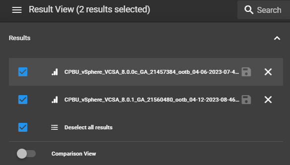

# MITRE Heimdall

## Overview

[MITRE's Heimdall Server](https://github.com/mitre/heimdall2) allows for visualizing, storing, and comparing scan results from various security tools.

## Prerequisites

* Infrastructure to deploy Heimdall Server on.

## Installation

Heimdall is most easily deployed via Docker or Kubernetes. 

Demo instances are available at [Heimdall Lite](https://heimdall-lite.mitre.org/) or [Heimdall](https://heimdall-demo.mitre.org/). 

*Note: The demo environments are for demonstration use only, please do not provide any personal identifying information or load real mission data into this system, even if the data is from non-production environments.*

For a full list of installation options, see [Installation](https://github.com/mitre/heimdall2#getting-started--installation).

## Usage
All of the documentation below will be in the context of working with InSpec results. Using results from other tools may vary.  

### Viewing Results

After login in files can either simply be dragged over to the window to load them or the "Choose files to upload" link can be clicked to browse for results files:  

After loading a result a visualization of that result is shown where the compliance status can be viewed and filtered based on any available criteria - for example, only showing controls that failed:  

Further down the page each control can be expanded to view specifics and test results:  

### Exporting Results
Results can also be exported to various other formats as shown in the screenshot below:  

### Comparing Results
If more than one scan needs to be compared (from "like" scan results), multiple scan results can be loaded, and the comparison view can be enabled by using the button shown below:  

After the comparison view is enabled a visualization of the differences between the two results is shown, including which controls changed status:  

## References
For more information, see the [Heimdall Github Page](https://github.com/mitre/heimdall2).