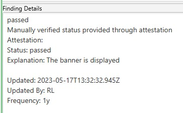
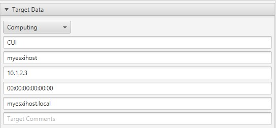

# MITRE SAF CLI

## Overview

The [MITRE Security Automation Framework (SAF) Command Line Interface (CLI)](https://github.com/mitre/saf) brings together applications, techniques, libraries, and tools developed by MITRE and the security community to streamline security automation for systems and DevOps pipelines.

In this context the SAF CLI is used for the following tasks:

* Creating and applying manual attestations to InSpec results.
* Converting InSpec results to a STIG Checklist(CKL) format.
* Converting STIG XCCDF files to InSpec profiles to stub out a new profile.

## Prerequisites
* Windows, Linux, and Mac are supported.

## Installation
Download the package for your OS for a release [here](https://github.com/mitre/saf/releases).

For a full list of installation options, see [Installation](https://github.com/mitre/saf#installation-1).

## Usage

### Creating and applying manual attestations
Attest to 'Not Reviewed' controls - sometimes requirements can’t be tested automatically by security tools and hence require manual review, whereby someone interviews people and/or examines a system to confirm (i.e., attest to) whether the control's requirements have been satisfied.

The example covered will work with InSpec results but this process can be applied to any report from various supported security tools in the SAF ecosystem.

#### Create Attestations Usage Help
```
attest create              Create attestation files for use with `saf attest apply`

USAGE
  $ saf attest create -o <attestation-file> [-i <hdf-json> -t <json | xlsx | yml | yaml>]

FLAGS
  -i, --input=<value>    (optional) An input HDF file to search for controls
  -o, --output=<value>   (required) The output filename
  -t, --format=<option>  [default: json] (optional) The output file type
                         <options: json|xlsx|yml|yaml>

  GLOBAL FLAGS
    -h, --help               Show CLI help
    -L, --logLevel=<option>  [default: info] Specify level for logging (if implemented by the CLI command)
                             <options: info|warn|debug|verbose>
        --interactive        Collect input tags interactively (not available on all CLI commands)

EXAMPLES
  $ saf attest create -o attestation.json -i hdf.json

  $ saf attest create -o attestation.xlsx -t xlsx
```

#### Apply Attestations Usage Help
```
attest apply              Apply one or more attestation files to one or more HDF results sets

USAGE
  $ saf attest apply -i <input-hdf-json>... <attestation>... -o <output-hdf-path>

FLAGS
  -i, --input=<value>...  (required) Your input HDF and Attestation file(s)
  -o, --output=<value>    (required) Output file or folder (for multiple executions)

  GLOBAL FLAGS
    -h, --help               Show CLI help
    -L, --logLevel=<option>  [default: info] Specify level for logging (if implemented by the CLI command)
                             <options: info|warn|debug|verbose>
        --interactive        Collect input tags interactively (not available on all CLI commands)

EXAMPLES
  $ saf attest apply -i hdf.json attestation.json -o new-hdf.json

  $ saf attest apply -i hdf1.json hdf2.json attestation.xlsx -o outputDir
```

#### Creating an attestation file example
An attestation file can be created by using SAF CLI or by just manually creating a file.

Using SAF CLI to create a file:
```powershell
# Provide the report json as input and in this example yml is being used as the format but json is also supported
saf attest create -i .\vSphere_ESXi_8.0.1_GA_21495797_ootb_04-12-2023-09-05.json -o .\attestation-example.yml -t yml

# Controls can be searched for by entering a partial STIG ID
Enter a control ID, search for a control, or enter 'q' to exit: esxi-80-00000
        ESXI-80-000005: The ESXi host must enforce the limit of three consecutive invalid logon attempts by a user.
        ESXI-80-000006: The ESXi host must display the Standard Mandatory DOD Notice and Consent Banner before granting access to the system via the Direct Console User Interface (DCUI).
        ESXI-80-000008: The ESXi host must enable lockdown mode.
# For the control to attest to enter the control ID exactly as it is case sensitive. Prompts to fill out some questions will follow.
Enter a control ID, search for a control, or enter 'q' to exit: ESXI-80-000006
Attestation explanation: The banner is displayed
Frequency (1d/3d/1wk/2wk/1m/3m/6m/1y/1.5y/custom): 1y
Enter status ((p)assed/(f)ailed): passed
Updated By: RL
Enter a control ID, search for a control, or enter 'q' to exit: q
```

This results in a yaml file that looks like the following:
```yaml
- control_id: ESXI-80-000006
  explanation: The banner is displayed
  frequency: 1y
  status: passed
  updated: 2023-05-17T13:32:32.945Z
  updated_by: RL
```

Now that the format is known it may be easier to just add all of the controls needing manual attestation to the attestation file directly.

#### Applying an attestation file to a result example
The next step is to apply the attestation file to the original report to then create a new report that includes our manual attestations:

```powershell
# Provide the original report followed by the attestation file created then for the output provide a name for a new report
saf attest apply -i .\vSphere_ESXi_8.0.1_GA_21495797_ootb_04-12-2023-09-05.json .\attestation-example.yml -o .\My_new_report_with_attestations.json
```

Examining the new report will then reveal this on the control the attestation was provided for:
```json
{
  "code_desc": "Manually verified status provided through attestation",
  "status": "passed",
  "message": "Attestation:\nStatus: passed\nExplanation: The banner is displayed\n\nUpdated: 2023-05-17T13:32:32.945Z\nUpdated By: RL\nFrequency: 1y",
  "start_time": "2023-05-17T13:49:06.601Z"
}
```
Now when this report is converted to a CKL file this information will be carried forward.

### Converting InSpec results to CKL
#### HDF to Checklist Usage Help
```
convert hdf2ckl               Translate a Heimdall Data Format JSON file into a
                              DISA checklist file

  USAGE
    $ saf convert hdf2ckl -i <hdf-scan-results-json> -o <output-ckl> [-h] [-m <metadata>] [--profilename <value>] [--profiletitle <value>] [--version <value>] [--releasenumber <value>] [--releasedate <value>] [--marking <value>] [-H <value>] [-I <value>] [-M <value>] [-F <value>] [--targetcomment <value>] [--role Domain Controller|Member Server|None|Workstation] [--assettype Computing|Non-Computing] [--techarea |Application Review|Boundary Security|CDS Admin Review|CDS Technical Review|Database Review|Domain Name System (DNS)|Exchange Server|Host Based System Security (HBSS)|Internal Network|Mobility|Other Review|Releasable Networks (REL)|Releaseable Networks (REL)|Traditional Security|UNIX OS|VVOIP Review|Web Review|Windows OS] [--stigguid <value>] [--targetkey <value>] [--webdbsite <value> --webordatabase] [--webdbinstance <value> ] [--vulidmapping gid|id]

  FLAGS
    -h, --help            Show CLI help.
    -i, --input=<value>   (required) Input HDF file
    -o, --output=<value>  (required) Output CKL file

  CHECKLIST METADATA FLAGS
    -F, --fqdn=<value>           Fully Qualified Domain Name
    -H, --hostname=<value>       The name assigned to the asset within the network
    -I, --ip=<value>             IP address
    -M, --mac=<value>            MAC address
    -m, --metadata=<value>       Metadata JSON file, generate one with "saf generate ckl_metadata"
        --assettype=<option>     The category or classification of the asset
                                <options: Computing|Non-Computing>
        --marking=<value>        A security classification or designation of the asset, indicating its sensitivity level
        --profilename=<value>    Profile name
        --profiletitle=<value>   Profile title
        --releasedate=<value>    Profile release date
        --releasenumber=<value>  Profile release number
        --role=<option>          The primary function or role of the asset within the network or organization
                                <options: Domain Controller|Member Server|None|Workstation>
        --stigguid=<value>       A unique identifier associated with the STIG for the asset
        --targetcomment=<value>  Additional comments or notes about the asset
        --targetkey=<value>      A unique key or identifier for the asset within the checklist or inventory system
        --techarea=<option>      The technical area or domain to which the asset belongs
                                <options: |Application Review|Boundary Security|CDS Admin Review|CDS Technical Review|Database Review|Domain Name System (DNS)|Exchange Server|Host Based System Security (HBSS)|Internal Network|Mobility|Other Review|Releasable Networks (REL)|Releaseable Networks (REL)|Traditional Security|UNIX OS|VVOIP Review|Web Review|Windows OS>
        --version=<value>        Profile version number
        --vulidmapping=<option>  Which type of control identifier to map to the checklist ID
                                <options: gid|id>
        --webdbinstance=<value>  The specific instance of the web application or database running on the server
        --webdbsite=<value>      The specific site or application hosted on the web or database server
        --webordatabase          Indicates whether the STIG is primarily for either a web or database server

  DESCRIPTION
    Translate a Heimdall Data Format JSON file into a DISA checklist file

  EXAMPLES
    $ saf convert hdf2ckl -i rhel7-results.json -o rhel7.ckl --fqdn reverseproxy.example.org --hostname reverseproxy --ip 10.0.0.3 --mac 12:34:56:78:90:AB

    $ saf convert hdf2ckl -i rhel8-results.json -o rhel8.ckl -m rhel8-metadata.json
```


#### Convert HDF(InSpec JSON) to STIG Checklist example
```powershell
saf convert hdf2ckl -i .\My_new_report_with_attestations.json -o my_new_ckl.ckl --hostname myesxihost --fqdn myesxihost.local --ip 10.1.2.3 --mac 00:00:00:00:00:00
```

After importing into STIG viewer the manual attestation can be seen on control ESXI-80-000006 in the finding details:  


The host info provided is also populated in the target data:  


### Convert XCCDF to InSpec
When starting a new profile for a STIG it is not feasible to manually populate all of a STIG's metadata (title,check,fix,discussion,ids,severity,etc.) into the control files.

SAF CLI offers a command to take an XCCDF xml file from a STIG as an input and output a stubbed out InSpec profile that includes all of this data where then only the tests for each control need to be added.


#### XCCDF to InSpec Profile Usage Help
```
generate inspec_profile              Generate a new skeleton profile based on a (STIG or CIS) XCCDF benchmark file 

USAGE
  $ saf generate inspec_profile -X <stig-xccdf-xml> [-O <oval-xccdf-xml] [-o <output-folder>] [-m <metadata-json>] [-T (rule|group|cis|version)] [-s] [-L (info|warn|debug|verbose)] [-h] [--interactive]

FLAGS
  -X, --xccdfXmlFile=<value>     (required) Path to the XCCDF benchmark file  
  -O, --ovalDefinitions=<value>  Path to an OVAL definitions file to populate profile elements that reference OVAL definitions
  -T, --idType=<option>          [default: rule] Control ID Types: 'rule' - Vulnerability IDs (ex. 'SV-XXXXX'), 'group' -
                                 Group IDs (ex. 'V-XXXXX'), 'cis' - CIS Rule IDs (ex.
                                 C-1.1.1.1), 'version' - Version IDs (ex. RHEL-07-010020 - also known as STIG IDs)
                                 <options: rule|group|cis|version>
  -m, --metadata=<value>         Path to a JSON file with additional metadata for the inspec.yml
                                 The metadata Json is of the following format:
                                 {"maintainer": string, "copyright": string, "copyright_email": string, "license": string, "version": string}
  -o, --output=<value>           [default: profile] The output folder to write the generated InSpec content (defaults to profile if 
                                 unable to translate xccdf title)
  -s, --singleFile               Output the resulting controls as a single file

  GLOBAL FLAGS
    -h, --help               Show CLI help
    -L, --logLevel=<option>  [default: info] Specify level for logging (if implemented by the CLI command)
                             <options: info|warn|debug|verbose>
        --interactive        Collect input tags interactively (not available on all CLI commands)

ALIASES
  $ saf generate xccdf_benchmark2inspec_stub

EXAMPLES
  $ saf generate xccdf_benchmark2inspec_stub -X ./U_RHEL_6_STIG_V2R2_Manual-xccdf.xml -T group --logLevel debug -r rhel-6-update-report.md
  $ saf generate xccdf_benchmark2inspec_stub -X ./CIS_Ubuntu_Linux_18.04_LTS_Benchmark_v1.1.0-xccdf.xml -O ./CIS_Ubuntu_Linux_18.04_LTS_Benchmark_v1.1.0-oval.xml --logLevel debug
```


#### Convert XCCDF to InSpec Profile Example
```powershell
# The -T argument sets which ID to use as the control ID for InSpec. In this case STIG IDs are preferred as they are easier to reference. Other options are rule(Rule ID) and group(Vul ID)
saf generate inspec_profile -T version -i .\U_VMware_vSphere_8_ESXi_STIG_Readiness_Guide_V1R1-xccdf.xml -o my_esxi_profile
```

This will give us a profile with this folder structure:
```
my_esxi_profile
├── controls
│   ├── ESXI-80-000005.rb
│   └── ESXI-80-000006.rb
│   └── ...
├── libraries
└── inspec.yml
```

Control file example:
```ruby
control 'ESXI-80-000005' do
  title 'The ESXi host must enforce the limit of three consecutive invalid logon attempts by a user.'
  desc 'By limiting the number of failed logon attempts, the risk of unauthorized access via user password guessing, otherwise known as brute forcing, is reduced. Once the configured number of attempts is reached, the account is locked by the ESXi host.'
  desc 'check', 'From the vSphere Client, go to Hosts and Clusters.

Select the ESXi Host >> Configure >> System >> Advanced System Settings.

Select the "Security.AccountLockFailures" value and verify it is set to "3".

or

From a PowerCLI command prompt while connected to the ESXi host, run the following command:

Get-VMHost | Get-AdvancedSetting -Name Security.AccountLockFailures

If the "Security.AccountLockFailures" setting is set to a value other than "3", this is a finding.'
  desc 'fix', 'From the vSphere Client, go to Hosts and Clusters.

Select the ESXi Host >> Configure >> System >> Advanced System Settings.

Click "Edit". Select the "Security.AccountLockFailures" value and configure it to "3".

or

From a PowerCLI command prompt while connected to the ESXi host, run the following command:

Get-VMHost | Get-AdvancedSetting -Name Security.AccountLockFailures | Set-AdvancedSetting -Value 3'
  impact 0.5
  tag check_id: 'N/A'
  tag severity: 'medium'
  tag gid: 'V-ESXI-80-000005'
  tag rid: 'SV-ESXI-80-000005'
  tag stig_id: 'ESXI-80-000005'
  tag gtitle: 'SRG-OS-000021-VMM-000050'
  tag documentable: nil
  tag cci: ['CCI-000044']
  tag nist: ['AC-7 a']
end
```

## References
For the more information, see the [SAF CLI Documentation](https://saf-cli.mitre.org/).
