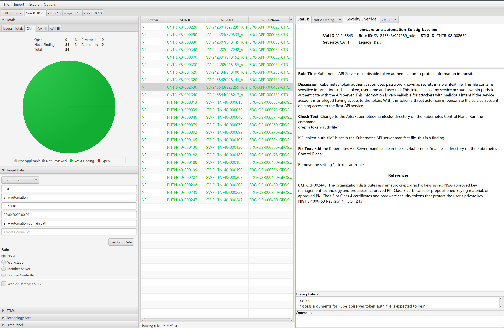

# Audit Aria Automation 8

## Overview
Auditing VMware Aria Automation for STIG compliance involves scanning the application, the Kubernetes and Docker services running on the appliance, and the underlying Photon OS.  

When auditing VMware Aria Automation we will split up tasks between product and appliance based controls which are defined as follows:
* **Product Control:** Configurations that interact with the Product via the User Interface or API that are exposed to administrators. Whether these are Default or Non-Default, the risk of mis-configuration affecting availability of the product is low but could impact how the environment is operated if not assessed.
* **Appliance Control:** Appliance controls deal with the underlying components (databases, web servers, Photon OS, etc.) that make up the product. Altering these add risk to product availability if precautionary steps and care in implementation are not taken. Identifying and relying on Default settings in this category makes this category less risky (Default Appliance Controls should be seen as a positive).

The VMware Aria Automation auditing uses InSpec over an SSH connection. It is recommended to disable SSH after the auditing is complete.

## Prerequisites
Versions listed below were used for this documentation. Other versions of these tools may work as well but if issues are found it is recommended to utilize the versions listed here.  

* The [vmware-aria-automation-8x-stig-baseline](https://github.com/vmware/dod-compliance-and-automation/tree/master/aria/automation/8.x/v1r6-srg/inspec/vmware-aria-automation-8x-stig-baseline) profile downloaded.
* The [vmware-photon-4.0-stig-baseline](https://github.com/vmware/dod-compliance-and-automation/tree/master/photon/4.0/v1r5-srg/inspec/vmware-photon-4.0-stig-baseline) profile downloaded.
* InSpec/Cinc Auditor 6.8.1
* SAF CLI 1.4.0
* [STIG Viewer 2.17](https://public.cyber.mil/stigs/srg-stig-tools/)
* A VMware Aria Automation environment. Version 8.18 was used in these examples.
* An account with SSH access to VMware Aria Automation.

### Assumptions
* Commands are initiated from a Linux machine. Windows will also work but paths and commands may need to be adjusted from the examples.
* The [DOD Compliance and Automation](https://github.com/vmware/dod-compliance-and-automation) repository has been downloaded and extracted to `/usr/share/stigs`.
* CINC Auditor is used in lieu of InSpec. If InSpec is used replace `cinc-auditor` with `inspec` when running commands.

## Auditing VMware Aria Automation
### Update profile inputs
Included in each of the `vmware-vra-8x-stig-baseline` sub-folders (aria-automation, docker, and kubernetes) is an inspec input file named 'inspec.yml'. 
Additionally, at the top level, an `inputs-example.yml` file can be created that "rolls up" all of the variables into one file, and can be utilized at the command line.

Evaluate each of the input files (`aria-automation/inspec.yml`, `docker\inspec.yml`, `kubernetes\inspec.yml`), and if any of the input variables need to be over-ridden, then make sure those variables are included in the top level `inputs-example.yml` file. Examples are provided below.

#### VMware Aria Automation - Sample Inputs
```yml
syslogHost: "log.test.local"
ntpServers: "['time1.server.org', 'time2.server.org']"
maxAuthTries: "2"
```

### Update the SSH config to allow scan
If the VMware Aria Automation appliance has SSH access disabled, the scans will not be able to run. SSH must be temporarily enabled to complete the scan, then can be disabled again once the audit is complete.  

```bash
# Connect to the console through vCenter
vi /etc/ssh/sshd_config
# Update PermitRootLogin from no to yes and save
systemctl restart sshd
```

### Run the audit
### Navigate to the InSpec profile folder
cd /usr/share/stigs/aria/automation/8.x/v1r6-srg/inspec/vmware-aria-automation-8x-stig-baseline  

In this example a target VMware Aria Automation appliance will be scanned, specifying an inputs file, and outputting a report to the CLI and to a JSON file.
  
```bash
# Note this command is run from the root of the profile folder. Update paths as needed (instead of '.', use './path/to/profile') if running from a different location.
> cinc-auditor exec . -t ssh://root@aria-automation.domain.path --password 'replaceme' --show-progress --input-file inputs-example.yml --reporter cli json:/tmp/reports/Aria_Automation_8x_STIG_Report.json

# Shown below is example output at the CLI.
  ✔  PHTN-40-000227: The Photon operating system must not send IPv4 Internet Control Message Protocol redirects.
     ✔  Kernel Parameter net.ipv4.conf.all.send_redirects value is expected to cmp == 0
     ✔  Kernel Parameter net.ipv4.conf.default.send_redirects value is expected to cmp == 0
  ✔  PHTN-40-000228: The Photon operating system must log IPv4 packets with impossible addresses.
     ✔  Kernel Parameter net.ipv4.conf.all.log_martians value is expected to cmp == 1
     ✔  Kernel Parameter net.ipv4.conf.default.log_martians value is expected to cmp == 1
  ✔  PHTN-40-000229: The Photon operating system must use a reverse-path filter for IPv4 network traffic.
     ✔  Kernel Parameter net.ipv4.conf.all.rp_filter value is expected to cmp == 1
     ✔  Kernel Parameter net.ipv4.conf.default.rp_filter value is expected to cmp == 1

Profile Summary: zz successful controls, zz control failures, zz controls skipped
Test Summary: zz successful, zz failures, zz skipped
```

## Convert the results to CKL
If a STIG Viewer Checklist (CKL) file is needed then the results from the scans can be converted to CKL with the [SAF CLI](/docs/automation-tools/safcli.md).

```bash
# Converting the scan results from the prior section to CKL
saf convert hdf2ckl -i /tmp/reports/Aria_Automation_8x_STIG_Report.json -o /tmp/reports/Aria_Automation_8x_STIG_Report.ckl --hostname aria-automation --fqdn aria-automation.domain.path --ip 10.10.10.20 --mac 00:00:00:00:00:00
```

Opening the CKL file in STIG Viewer will look like the example screenshot below. Note the InSpec results are included in the `Finding Details` pane.  
