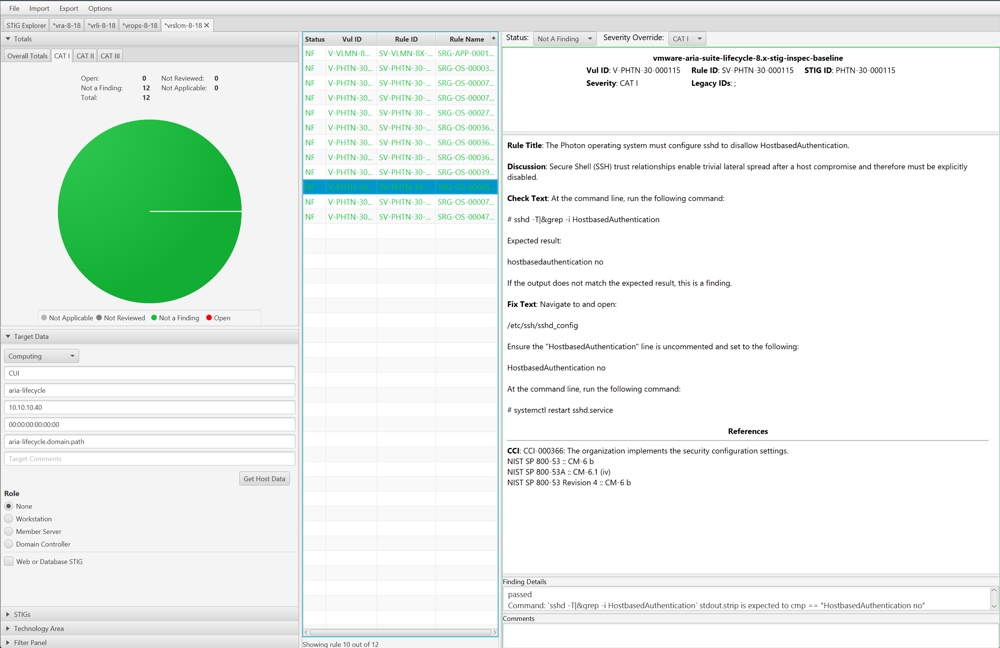

# Audit Aria Suite Lifecycle 8

## Overview
Auditing VMware Aria Suite Lifecycle for STIG compliance involves scanning the NGINX and vpostgres components, the underlying Photon OS, and the application itself.

When auditing VMware Aria Suite Lifecycle we will split up tasks between product and appliance based controls which are defined as follows:

* **Product Control:** Configurations that interact with the Product via the User Interface or API that are exposed to administrators. Whether these are Default or Non-Default, the risk of mis-configuration affecting availability of the product is low but could impact how the environment is operated if not assessed.
* **Appliance Control:** Appliance controls deal with the underlying components (databases, web servers, Photon OS, etc) that make up the product. Altering these add risk to product availability if precautionary steps and care in implementation are not taken. Identifying and relying on Default settings in this category makes this category less risky (Default Appliance Controls should be seen as a positive).

To audit VMware Aria Suite Lifecycle using InSpec we utilize the ssh transport which connects to the appliance via ssh and performs queries. It is recommended to disable SSH on the appliance after the auditing is complete.

## Prerequisites
Versions listed below were used for this documentation. Other versions of these tools may work as well but if issues are found it is recommended to utilize the versions listed here.  

* The [vmware-vrslcm-8.x-stig-baseline](https://github.com/vmware/dod-compliance-and-automation/tree/master/aria/lifecycle/8.x/v1r2-srg/inspec/vmware-vrslcm-8.x-stig-baseline) profile downloaded.
* InSpec/Cinc Auditor 6.8.1
* SAF CLI 1.4.0
* [STIG Viewer 2.17](https://public.cyber.mil/stigs/srg-stig-tools/)
* A VMware Aria Suite Lifecycle environment. Version 8.18 was used in these examples.
* An account with SSH access to VMware Aria Suite Lifecycle.

### Assumptions
* Commands are initiated from a Linux machine. Windows will also work but paths and commands may need to be adjusted from the examples.
* The [DOD Compliance and Automation](https://github.com/vmware/dod-compliance-and-automation) repository has been downloaded and extracted to `/usr/share/stigs`.
* CINC Auditor is used in lieu of InSpec. If InSpec is used replace `cinc-auditor` with `inspec` when running commands.

## Auditing VMware Aria Suite Lifecycle
### Navigate to the InSpec profile folder
cd /usr/share/stigs/aria/lifecycle/8.x/v1r2-srg/inspec/vmware-vrslcm-8.x-stig-baseline  

### Update profile inputs
Included in each of the `vmware-vrslcm-8.x-stig-baseline` sub-folders (application, nginx, photon, and vpostgres) is an inspec input file named 'inspec.yml'. 
Additionally, at the top level, an `inputs-example.yml` file is included that "rolls up" all of the variables into one file, and can be edited and utilized at the command line.

Evaluate each of the input files (`application/inspec.yml`, `nginx/inspec.yml`, `photon/inspec.yml`, `vpostgres/inspec.yml`), and if any of the input variables need to be over-ridden, then make sure those variables are included in the top level `inputs-example.yml` file. Examples are provided below.

#### VMware Aria Operations for Logs - Sample Inputs
```yaml
# Application
hostname:                         "lifecycle.domain"
username:                         "admin@local"
password:                         "password"
ntpServers:                       ["time-a-b.nist.gov", "time-a-c.nist.gov"] 

# NGINX
limit_conn_server_limit:          "1000"
hsts_header:                      "max-age=31536000"
nginx_ssl_session_timeout:        "5m"
nginx_keepalive_timeout:          "65"
```

### Update the SSH config to allow scan
If the VMware Aria Suite Lifecycle appliance has SSH access disabled, the scans will not be able to run. SSH must be temporarily enabled to complete the scan, then can be disabled again once the audit is complete.  

```bash
# Connect to the console through vCenter
vi /etc/ssh/sshd_config
# Update PermitRootLogin from no to yes and save
systemctl restart sshd
```

### Run the audit
In this example a target VMware Aria Suite Lifecycle appliance will be scanned, specifying an inputs file, and outputting a report to the CLI and to a JSON file.  
```bash
# Note this command is run from the root of the profile folder. Update paths as needed (instead of '.', use './path/to/profile') if running from a different location.
> cinc-auditor exec . -t ssh://root@aria-lifecycle.domain.path --password 'replaceme' --show-progress --input-file inputs-example.yml --reporter cli json:/tmp/reports/Aria_Lifecycle_8x_STIG_Report.json

# Shown below is example output at the CLI.
  ✔  PHTN-30-000119: The Photon operating system must configure sshd to restrict AllowTcpForwarding.
     ✔  Command: `sshd -T|&grep -i allowtcpforwarding` stdout.strip is expected to cmp == "allowtcpforwarding no"
  ✔  PHTN-30-000120: The Photon operating system must configure sshd to restrict LoginGraceTime.
     ✔  Command: `sshd -T|&grep -i LoginGraceTime` stdout.strip is expected to cmp == "LoginGraceTime 30"
  ✔  PHTN-30-000240: The Photon operating system must implement NIST FIPS-validated cryptography for the following: to provision digital signatures, generate cryptographic hashes, and protect unclassified information requiring confidentiality and cryptographic protection in accordance with applicable federal laws, Executive Orders, directives, policies, regulations, and standards.
     ✔  File /proc/sys/crypto/fips_enabled content is expected to cmp == 1
  ✔  PHTN-30-000245: The Photon operating system must disable systemd fallback Domain Name System (DNS).
     ✔  Command: `resolvectl status | grep 'Fallback DNS'` stdout is expected to cmp == ""


Profile Summary: zz successful controls, zz control failures, zz controls skipped
Test Summary: zz successful, zz failures, zz skipped
```

## Convert the results to CKL
If a STIG Viewer Checklist (CKL) file is needed then the results from the scans can be converted to CKL with the [SAF CLI](/docs/automation-tools/safcli/).

```bash
# Converting the scan results from the prior section to CKL
saf convert hdf2ckl -i /tmp/reports/Aria_Lifecycle_8x_STIG_Report.json -o /tmp/reports/Aria_Lifecycle_8x_STIG_Report.ckl --hostname aria-lifecycle --fqdn aria-lifecycle.domain.path --ip 10.10.10.20 --mac 00:00:00:00:00:00
```

Opening the CKL file in STIG Viewer will look like the example screenshot below. Note the InSpec results are included in the `Finding Details` pane.  
