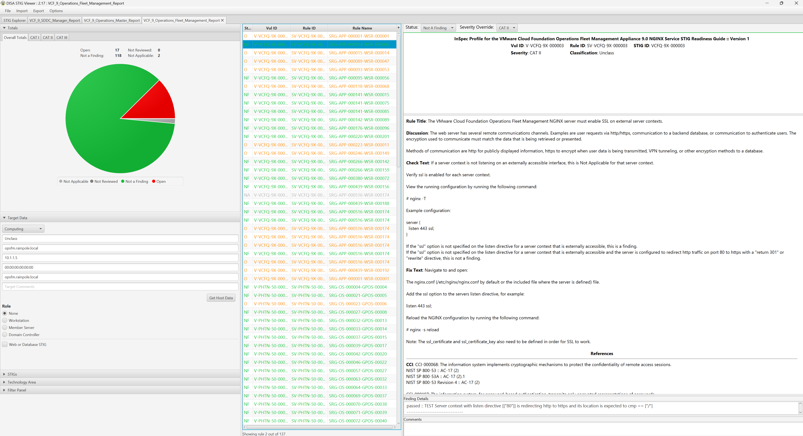

# Audit VCF Operations Fleet Management 9.x
Auditing VCF Operations Fleet Management 9.x for STIG Compliance

## Overview
This tutorial covers auditing the Operations Fleet Management appliance in VCF deployments.  

The example commands below are specific to the product version and the supported STIG content for the version being run. Select the appropriate tab for the target version.

### Prerequisites
Versions listed below were used for this documentation. Other versions of these tools may work as well but if issues are found it is recommended to try the versions listed here.  

* InSpec/Cinc Auditor 6.8.24
* SAF CLI 1.4.20
* STIG Viewer 2.17
* A VCF 9.0.0.0 or newer environment.
* SSH access to the Operations Fleet Management appliance.

### Assumptions
* Commands are being run from a Linux machine. Windows will also work but paths and commands may need to be adjusted from the examples.
* The [DOD Compliance and Automation](https://github.com/vmware/dod-compliance-and-automation) repository has beens downloaded and extracted to `/usr/share/stigs`.
* CINC Auditor is used in lieu of InSpec. If InSpec is used replace `cinc-auditor` with `inspec` when running commands.
* The `vmware-photon-5.0-stig-baseline` profile has been staged under the same parent folder as this `vmware-cloud-foundation-operations-fleet-management-stig-baseline` profile.

## Auditing Operations Fleet Management Appliance Rules
Auditing the Operations Fleet Management appliance is done over SSH which must be enabled for the scan.

### Run the audit
In this example an Operations Fleet Management appliance will be scanned, outputting a report to the CLI and to a JSON file.  

### Version: 9.0.0.0
```
# Navigate to the InSpec profile folder
cd /usr/share/stigs/vcf/9.x/Y25M06-srg/inspec/vmware-cloud-foundation-operations-fleet-management-stig-baseline/

# Run the audit
cinc-auditor exec . -t ssh://root@opsfm.rainpole.local --password 'password' --show-progress --enhanced-outcomes --reporter cli json:/tmp/reports/VCF_9_Operations_Fleet_Management_Report.json

# Shown below is the last part of the output at the CLI.
Profile Summary: 255 successful controls, 17 control failures, 0 controls not reviewed, 2 controls not applicable, 0 controls have error
Test Summary: 547 successful, 28 failures, 2 skipped
```

## Convert the results to CKL
If a STIG Viewer CKL file is needed then the results from the scans can be converted to CKL with the [SAF CLI](/docs/automation-tools/safcli/).

### Update the target details in the metadata file

### Version: 9.0.0.0
```
# Update the saf_cli_hdf2ckl_metadata.json file
vi /usr/share/stigs/vcf/9.x/Y25M06-srg/inspec/vmware-cloud-foundation-operations-fleet-management-stig-baseline/saf_cli_hdf2ckl_metadata.json

"hostname": "opsfm.rainpole.local",
"hostip": "10.1.1.3",
"hostmac": "00:00:00:00:00:00",
"hostfqdn": "opsfm.rainpole.local",
```

### Run SAF CLI to create the CKL file
The following command will convert the json result from the InSpec audit into a STIG Checklist file and ensure the correct metadata is inserted so that it displays correctly in STIG Viewer.  
### Version: 9.0.0.0
```
# Convert the InSpec report to a STIG Checklist
saf convert hdf2ckl -i /tmp/reports/VCF_9_Operations_Fleet_Management_Report.json -o /tmp/reports/VCF_9_Operations_Fleet_Management_Report.ckl -m /usr/share/stigs/vcf/9.x/Y25M06-srg/inspec/vmware-cloud-foundation-operations-fleet-management-stig-baseline/saf_cli_hdf2ckl_metadata.json
```

Opening the CKL file in STIG Viewer will look like the screenshot below. Note the InSpec results are included in the `Finding Details` pane.  


## Next
If needed proceed to the remediation tutorial for the Operations Fleet Management appliance [here](./remediate9-opsfm.md).
