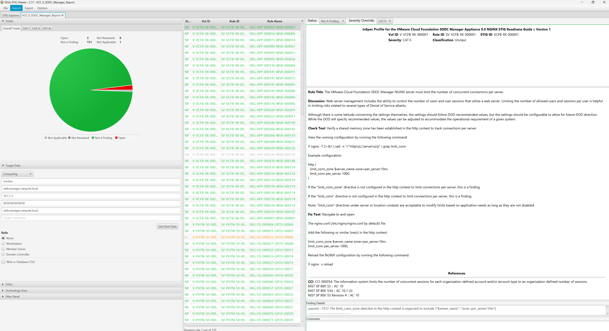

# Audit VCF SDDC Manager 9.x
Auditing VCF SDDC Manager 9.x for STIG Compliance

## Overview
This tutorial covers auditing the SDDC Manager appliance in VCF deployments.  

The example commands below are specific to the product version and the supported STIG content for the version being run.

### Prerequisites
Versions listed below were used for this documentation. Other versions of these tools may work as well but if issues are found it is recommended to try the versions listed here.  

* InSpec/Cinc Auditor 6.8.24
* SAF CLI 1.4.20
* STIG Viewer 2.17
* A VCF 9.0.0.0 or newer environment.
* SSH access to the SDDC Manager appliance.

### Assumptions
* Commands are being run from a Linux machine. Windows will also work but paths and commands may need to be adjusted from the examples.
* The [DOD Compliance and Automation](https://github.com/vmware/dod-compliance-and-automation) repository has been downloaded and extracted to `/usr/share/stigs`.
* CINC Auditor is used in lieu of InSpec. If InSpec is used replace `cinc-auditor` with `inspec` when running commands.
* The `vmware-photon-5.0-stig-baseline` profile has been staged under the same parent folder as this `vmware-cloud-foundation-sddcmgr-stig-baseline` profile.

## Auditing SDDC Manager Appliance Rules
Auditing the SDDC Manager appliance is done over SSH which must be enabled for the scan.

### Update the SSH config to allow scan
By default the SDDC Manager appliance does not allow root SSH and the `vcf` user does not have the required privileges to complete the scan so root SSH must be temporarily enabled to complete the scan. These steps can be reversed once the audit is complete.  

```bash
# Allow root SSH into SDDC manager
ssh vcf@sddcmanager.rainpole.local
su -
# Update PermitRootLogin from no to yes
sed -i '/PermitRootLogin no/c\PermitRootLogin yes' /etc/ssh/sshd_config
systemctl restart sshd
```

### Run the audit
In this example an SDDC Manager appliance will be scanned, outputting a report to the CLI and to a JSON file.  

### Version: 9.0.0.0
```
# Navigate to the InSpec profile folder
cd /usr/share/stigs/vcf/9.x/Y25M06-srg/inspec/vmware-cloud-foundation-sddcmgr-stig-baseline/

# Run the audit
cinc-auditor exec . -t ssh://root@sddcmanager.rainpole.local --password 'password' --show-progress --enhanced-outcomes --reporter cli json:/tmp/reports/VCF_9_SDDC_Manager_Report.json

# Shown below is the last part of the output at the CLI.
Profile Summary: 306 successful controls, 3 control failures, 0 controls not reviewed, 1 control not applicable, 0 controls have error
Test Summary: 957 successful, 4 failures, 1 skipped
```

## Convert the results to CKL
If a STIG Viewer CKL file is needed then the results from the scans can be converted to CKL with the [SAF CLI](/docs/automation-tools/safcli/).

### Update the target details in the metadata file
First update the target hostname, hostip, hostmac, and hostfqdn fields in the `saf_cli_hdf2ckl_metadata.json` metadata file
### Version: 9.0.0.0
```
# Update the saf_cli_hdf2ckl_metadata.json file
vi /usr/share/stigs/vcf/9.x/Y25M06-srg/inspec/vmware-cloud-foundation-sddcmgr-stig-baseline/saf_cli_hdf2ckl_metadata.json

"hostname": "sddcmanager.rainpole.local",
"hostip": "10.1.1.3",
"hostmac": "00:00:00:00:00:00",
"hostfqdn": "sddcmanager.rainpole.local",
```

### Run SAF CLI to create the CKL file
The following command will convert the json result from the InSpec audit into a STIG Checklist file and ensure the correct metadata is inserted so that it displays correctly in STIG Viewer.  
```
# Convert the InSpec report to a STIG Checklist
saf convert hdf2ckl -i /tmp/reports/VCF_9_SDDC_Manager_Report.json -o /tmp/reports/VCF_9_SDDC_Manager_Report.ckl -m /usr/share/stigs/vcf/9.x/Y25M06-srg/inspec/vmware-cloud-foundation-sddcmgr-stig-baseline/saf_cli_hdf2ckl_metadata.json
```

Opening the CKL file in STIG Viewer will look like the screenshot below. Note the InSpec results are included in the `Finding Details` pane.  


## Next
If needed proceed to the remediation tutorial for the SDDC Manager appliance [here](./remediate9-sddcmgr.md).
