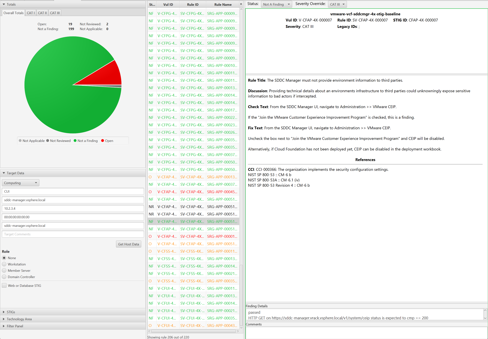

# Audit VCF 4.x

## Overview
Auditing VCF for STIG compliance involves scanning the SDDC Manager appliance.  

Scanning other components of a VCF deployment such as [vSphere](../vsphere/vsphere.md) and [NSX](../nsx/nsx.md) is documented in those sections on this site.

## Prerequisites
Versions listed below were used for this documentation. Other versions of these tools may work as well but if issues are found it is recommended to try the versions listed here.  

* The [vmware-cloud-foundation-sddcmgr-4x-stig-baseline](https://github.com/vmware/dod-compliance-and-automation/tree/master/vcf/4.x/inspec/vmware-vcf-sddcmgr-4x-stig-baseline) profile downloaded.
* The [vmware-photon-3.0-stig-inspec-baseline](https://github.com/vmware/dod-compliance-and-automation/tree/master/photon/3.0/inspec/vmware-photon-3.0-stig-inspec-baseline) profile downloaded.
* InSpec/Cinc Auditor 5.22.3
* SAF CLI 1.2.20
* STIG Viewer 2.17
* A VCF 4.x environment. 4.5.1 was used in these examples.
* An account with access to VCF.

## Auditing SDDC Manager
### Generate bearer token for SDDC Manager
The SDDC Manager InSpec profile connects to the API via a bearer token to query the configurations to audit.

This is a curl example. This can also be done via other methods such as Postman.

```bash
# Run from a Linux machine.
curl -k 'https://sddc-manager.vrack.vsphere.local/v1/tokens' -i -X POST \
    -H 'Content-Type: application/json' \
    -H 'Accept: application/json' \
    -d '{
  "username" : "administrator@vsphere.local",
  "password" : "replaceme"
}'
```

A token can also be UI generated by going to the Developer Center >> API Explorer >> Tokens.  


Retrieve token by copying the value in the `accessToken` field.  


### Update profile inputs
Included in the `vmware-vcf-sddcmgr-4x-stig-baseline` is an example [inputs-vcf-sddcmgr-4x-example](https://github.com/vmware/dod-compliance-and-automation/tree/master/vcf/4.x/inspec/vmware-vcf-sddcmgr-4x-stig-baseline/inputs-vcf-sddcmgr-4x-example.yml) file with the following inputs relevant to SDDC Manager.

Update the inputs as shown below with values relevant to the environment. Specifically `syslogServer`,`sddcManager`,`bearerToken`,`sftpBackupsEnabled`,`sftpServer`,`ntpServers`,`currentVersion`,and `myVmwareAccount`.

```yml
# Inputs for NGINX
nginx_conf_path: /etc/nginx/nginx.conf
limit_conn_ip_limit: '100'
limit_conn_server_limit: '1000'
nginx_ssl_ciphers: 'ECDHE-ECDSA-AES256-GCM-SHA384:ECDHE-RSA-AES256-GCM-SHA384:ECDHE-ECDSA-AES128-GCM-SHA256:ECDHE-RSA-AES128-GCM-SHA256'
# Inputs for Photon OS.
authprivlog: /var/log/audit/auth.log
sshdcommand: "sshd -T -C 'user=vcf'"
# Enter environment specific syslog server with port. replace.local:514
syslogServer: 'replace.local:514'
# SDDC Manager Application
# Enter SDDC Manager FQDN/IP
sddcManager: 'sddc-manager.vsphere.local'
# Enter bearer token for API based tests
bearerToken: 'Bearer eyJhbGciOiJIUzI1NiJ9.eyJqdGkiOiJhOGVjYTViMS04OTMwLTRiOGYtOGJmMy0xM2U4NTg2MzE3MmYiLCJpYXQiOjE2ODU1NDUyMzQsInN1YiI6ImFkbWluaXN0cmF0b3JAdnNwaGVyZS5sb2NhbCIsImlzcyI6InZjZi1hdXRoIiwiYXVkIjoic2RkYy1zZXJ2aWNlcyIsIm5iZiI6MTY4NTU0NTIzNCwiZXhwIjoxNjg1NTQ4ODM0LCJ1c2VyIjoiYWRtaW5pc3RyYXRvckB2c3BoZXJlLmxvY2FsIiwibmFtZSI6ImFkbWluaXN0cmF0b3JAdnNwaGVyZS5sb2NhbCIsInNjb3BlIjpbIlJFU09VUkNFX0ZVTkNUSU9OQUxJVFlfV1JJVEUiLCJMSUNFTlNJTkdfSU5GT19SRUFEIiwiU0REQ19GRURFUkFUSU9OX1dSSVRFIiwiQVZOX1dSSVRFIiwiU0REQ19NQU5BR0VSX1JFQUQiLCJDRVJUX1dSSVRFIiwiQ09NUE9TQUJJTElUWV9XUklURSIsIkxJQ0VOU0VfS0VZX1JFQUQiLCJDT01QT1NBQklMSVRZX1JFQUQiLCJFREdFX0NMVVNURVJfV1JJVEUiLCJVU0VSX1JFQUQiLCJDUkVERU5USUFMX1dSSVRFIiwiQkFDS1VQX0NPTkZJR19SRUFEIiwiQ0xVU1RFUl9XUklURSIsIkFWTl9SRUFEIiwiVkFTQV9QUk9WSURFUl9SRUFEIiwiRE9NQUlOX1dSSVRFIiwiQ0VJUF9SRUFEIiwiU09TX1dSSVRFIiwiU0REQ19NQU5BR0VSX1dSSVRFIiwiTlRQX1dSSVRFIiwiVEFHX1dSSVRFIiwiREVQT1RfQ09ORklHX1dSSVRFIiwiU1lTVEVNX1JFQUQiLCJERVBPVF9DT05GSUdfUkVBRCIsIkhPU1RfV1JJVEUiLCJSRVNPVVJDRV9MT0NLX1dSSVRFIiwiQkFDS1VQX1JFU1RPUkVfUkVBRCIsIkNFUlRfUkVBRCIsIlVTRVJfV1JJVEUiLCJVUEdSQURFX1JFQUQiLCJPVEhFUl9SRUFEIiwiTElDRU5TSU5HX1dSSVRFIiwiU09TX1JFQUQiLCJFVkVOVF9XUklURSIsIlNFQ1VSSVRZX0NPTkZJR19SRUFEIiwiQ1JFREVOVElBTF9SRUFEIiwiSE9TVF9SRUFEIiwiQ0VJUF9XUklURSIsIlJFU09VUkNFX0xPQ0tfUkVBRCIsIk9USEVSX1dSSVRFIiwiTElDRU5TRV9LRVlfV1JJVEUiLCJSRVNPVVJDRV9GVU5DVElPTkFMSVRZX1JFQUQiLCJDQV9SRUFEIiwiVEFHX1JFQUQiLCJMSUNFTlNJTkdfUkVBRCIsIk5FVFdPUktfUE9PTF9XUklURSIsIldDUF9SRUFEIiwiTElDRU5TSU5HX0lORk9fV1JJVEUiLCJCQUNLVVBfUkVTVE9SRV9XUklURSIsIk5UUF9SRUFEIiwiRURHRV9DTFVTVEVSX1JFQUQiLCJFVkVOVF9SRUFEIiwiQkFDS1VQX0NPTkZJR19XUklURSIsIldDUF9XUklURSIsIlNFUlZJQ0VfQUNDT1VOVF9XUklURSIsIk5FVFdPUktfUE9PTF9SRUFEIiwiQ0FfV1JJVEUiLCJDTFVTVEVSX1JFQUQiLCJWQVNBX1BST1ZJREVSX1dSSVRFIiwiRE5TX1dSSVRFIiwiU1lTVEVNX1dSSVRFIiwiVlJTTENNX1dSSVRFIiwiRE5TX1JFQUQiLCJTRVJWSUNFX0FDQ09VTlRfUkVBRCIsIlNERENfRkVERVJBVElPTl9SRUFEIiwiRE9NQUlOX1JFQUQiLCJWUlNMQ01fUkVBRCIsIlVQR1JBREVfV1JJVEUiXSwicm9sZSI6WyJBRE1JTiJdfQ.Wqxti-ZId624KeH5vF'
# Set to true if file based/sftp backups are used for SDDC Manager. Set to false if image based backups are used.
sftpBackupsEnabled: true
# Enter environment specific sftp server.
sftpServer: '10.1.2.3'
# Enter environment specific ntp servers. This is an array.
ntpServers: ['time-a-g.nist.gov','time-b-g.nist.gov']
# Enter latest version of SDDC manager with build. 4.5.1.0-21682411
currentVersion: '4.5.1.0-21682411'
# Enter myvmware account used to pull updates in SDDC Manager if used.
myVmwareAccount: 'myvmwarevcfaccount@test.local'
```

### Update the SSH config to allow scan
By default the SDDC Manager appliance does not allow root SSH and the `vcf` does not have the required privileges to complete the scan so root SSH must be temporarily enabled to complate the scan. These steps can be reversed once the audit is complete.  

```bash
# Allow root SSH into SDDC manager
ssh vcf@sddc-manager.vsphere.local
su -
vi /etc/ssh/sshd_config

# Update PermitRootLogin from no to yes and save
systemctl restart sshd
```

### Run the audit
In this example a target SDDC Manager will be scanned, specifying an inputs file, and outputting a report to the CLI and to a JSON file - initiated from a linux machine.

```bash
# Note this command is being run from the root of the profile folder. Update paths as needed if running from a different location.
> inspec exec . -t ssh://root@sddc-manager.vsphere.local --password 'replaceme' --show-progress --input-file inputs-vcf-sddcmgr-4x-example.yml --reporter cli json:/tmp/reports/VCF_4.5.1_SDDC_Manager_STIG_Report.json

# Shown below is the last part of the output at the CLI.
Profile:   VMware Cloud Foundation SDDC Manager UI Profile (VMware Cloud Foundation SDDC Manager UI Profile)
Version:   1.0.4
Target:    ssh://root@10.0.0.4:22
Target ID: 3cb5cfd9-709c-564d-b529-36fb03269263

  ✔  CFUI-4X-000001: The SDDC Manager UI service log files must only be accessible by privileged users.
     ✔  File /var/log/vmware/vcf/sddc-manager-ui-app/access.log is expected not to be writable by others
     ✔  File /var/log/vmware/vcf/sddc-manager-ui-app/access.log group is expected to cmp == "vcf"
     ✔  File /var/log/vmware/vcf/sddc-manager-ui-app/access.log owner is expected to cmp == "vcf_sddc_manager_ui_app"
     ✔  File /var/log/vmware/vcf/sddc-manager-ui-app/supervisor.log is expected not to be writable by others
     ✔  File /var/log/vmware/vcf/sddc-manager-ui-app/supervisor.log group is expected to cmp == "vcf"
     ✔  File /var/log/vmware/vcf/sddc-manager-ui-app/supervisor.log owner is expected to cmp == "vcf_sddc_manager_ui_app"
     ✔  File /var/log/vmware/vcf/sddc-manager-ui-app/sddcManagerServer.log is expected not to be writable by others
     ✔  File /var/log/vmware/vcf/sddc-manager-ui-app/sddcManagerServer.log group is expected to cmp == "vcf"
     ✔  File /var/log/vmware/vcf/sddc-manager-ui-app/sddcManagerServer.log owner is expected to cmp == "vcf_sddc_manager_ui_app"
     ✔  File /var/log/vmware/vcf/sddc-manager-ui-app/cspViolationReport.log is expected not to be writable by others
     ✔  File /var/log/vmware/vcf/sddc-manager-ui-app/cspViolationReport.log group is expected to cmp == "vcf"
     ✔  File /var/log/vmware/vcf/sddc-manager-ui-app/cspViolationReport.log owner is expected to cmp == "vcf_sddc_manager_ui_app"
     ✔  File /var/log/vmware/vcf/sddc-manager-ui-app/sddc-manager-ui-activity.log is expected not to be writable by others
     ✔  File /var/log/vmware/vcf/sddc-manager-ui-app/sddc-manager-ui-activity.log group is expected to cmp == "vcf"
     ✔  File /var/log/vmware/vcf/sddc-manager-ui-app/sddc-manager-ui-activity.log owner is expected to cmp == "vcf_sddc_manager_ui_app"
  ✔  CFUI-4X-000002: The SDDC Manager UI service files must be verified for their integrity.
     ✔  Command: `rpm -V sddc-manager-ui-app | grep \"^..5......\"|grep -v -E "|\.properties"` stdout.strip is expected to eq ""
  ✔  CFUI-4X-000003: The SDDC Manager UI service must have WebDAV disabled.
     ✔  Command: `(cd /opt/vmware/vcf/sddc-manager-ui-app/server/node_modules/ && npm list 2>/dev/null | grep webdav)` stdout.strip is expected to eq ""
  ✔  CFUI-4X-000004: The SDDC Manager UI service directory tree must have permissions in an "out of the box" state.
     ✔  Command: `find /opt/vmware/vcf/sddc-manager-ui-app/ -xdev -type f -a '(' -perm -o+w -o -not -user vcf_sddc_manager_ui_app -o -not -group vcf ')' -exec ls -ld {} \;` stdout.strip is expected to eq ""
  ✔  CFUI-4X-000005: The SDDC Manager UI service log files must be moved to a permanent repository in accordance with site policy.
     ✔  File /etc/rsyslog.d/stig-services-sddc-manager-ui-app.conf content is expected to eq "module(load=\"imfile\" mode=\"inotify\")\ninput(type=\"imfile\"\n      File=\"/var/log/vmware/vcf/sd...\"\n      Tag=\"vcf-sddc-manager-ui-app-misc\"\n      Severity=\"info\"\n      Facility=\"local0\")"
  ×  CFUI-4X-000006: The SDDC Manager UI service systemd service definition permissions must be configured appropriately. (2 failed)
     ×  File /etc/systemd/system/sddc-manager-ui-app.service is expected not to be more permissive than "0640"
     expected `File /etc/systemd/system/sddc-manager-ui-app.service.more_permissive_than?("0640")` to be falsey, got true
     ✔  File /etc/systemd/system/sddc-manager-ui-app.service group is expected to cmp == "root"
     ✔  File /etc/systemd/system/sddc-manager-ui-app.service owner is expected to cmp == "root"
     ×  File /etc/systemd/system/sddc-manager-ui-db.service is expected not to be more permissive than "0640"
     expected `File /etc/systemd/system/sddc-manager-ui-db.service.more_permissive_than?("0640")` to be falsey, got true
     ✔  File /etc/systemd/system/sddc-manager-ui-db.service group is expected to cmp == "root"
     ✔  File /etc/systemd/system/sddc-manager-ui-db.service owner is expected to cmp == "root"


Profile Summary: 199 successful controls, 19 control failures, 2 controls skipped
Test Summary: 691 successful, 36 failures, 4 skipped
```

## Convert the results to CKL
If a STIG Viewer CKL file is needed then the results from the scans can be converted to CKL with the [SAF CLI](/docs/automation-tools/safcli.md).

```powershell
# Converting the VCSA scan results from the prior section to CKL
saf convert hdf2ckl -i /tmp/reports/VCF_4.5.1_SDDC_Manager_STIG_Report.json -o /tmp/reports/VCF_4.5.1_SDDC_Manager_STIG_Report.ckl --hostname sddc-manager.vsphere.local --fqdn sddc-manager.vsphere.local --ip 10.2.3.4 --mac 00:00:00:00:00:00
```

Opening the CKL file in STIG Viewer will look like the screenshot below. Note the InSpec results are included in the `Finding Details` pane.  
