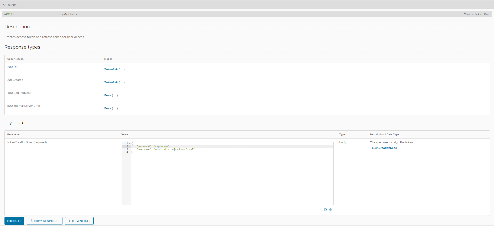
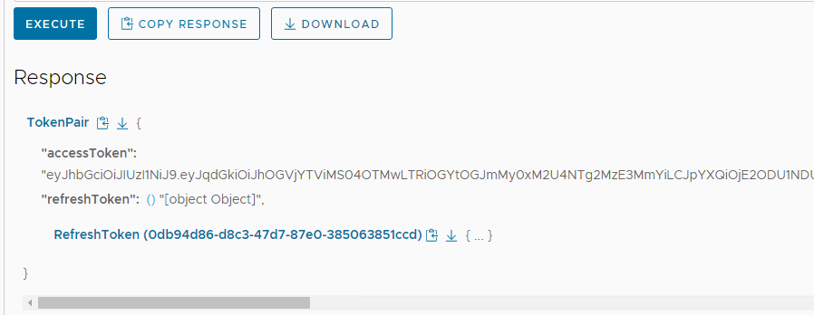
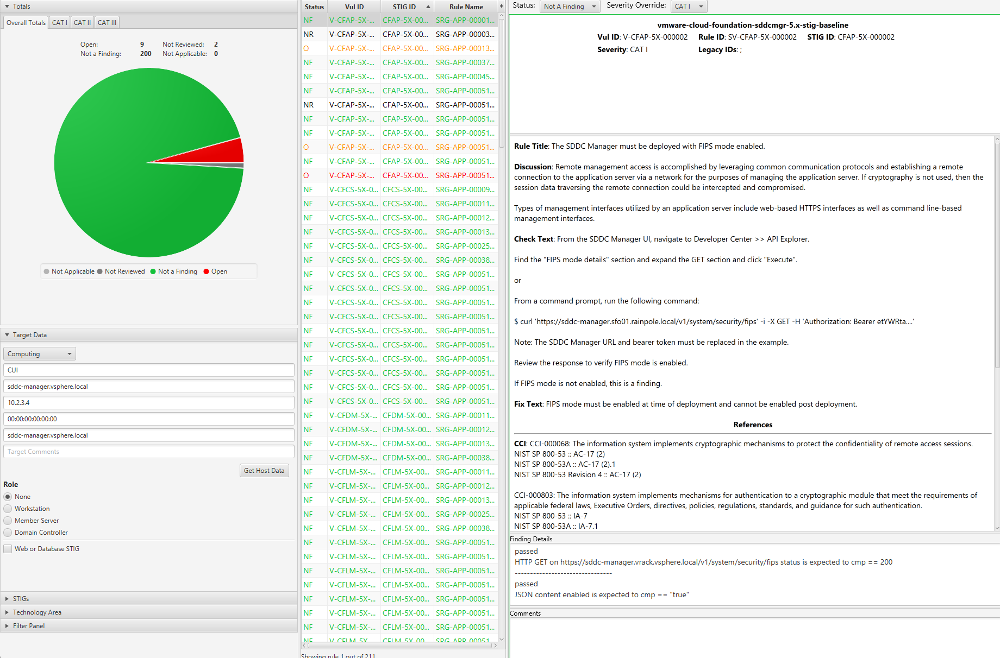

# Audit VCF 5.x

## Overview
Auditing VCF for STIG compliance involves scanning the SDDC Manager appliance.  

Scanning other components of a VCF deployment such as [vSphere](../vSphere/) and [NSX](../NSX/) is documented in those sections on this site.

### Prerequisites
Versions listed below were used for this documentation. Other versions of these tools may work as well but if issues are found it is recommended to try the versions listed here.  

* InSpec/CINC Auditor 6.6.0
* SAF CLI 1.4.0
* STIG Viewer 2.17
* A VCF 5.x environment.
* An account with access to VCF.

### Assumptions
* Commands are being run from a Linux machine. Windows will also work but paths and commands may need to be adjusted from the examples.
* The [DOD Compliance and Automation](https://github.com/vmware/dod-compliance-and-automation) repository has been downloaded and extracted to `/usr/share/stigs`.
* CINC Auditor is used in lieu of InSpec. If InSpec is used replace `cinc-auditor` with `inspec` when running commands.

## Auditing SDDC Manager
The example commands below are specific to the product version and the supported STIG content for the version being run. Select the example command tabs for the version in the environment.


### Generate bearer token for SDDC Manager
The SDDC Manager InSpec profile connects to the API via a bearer token to query some configurations when auditing.

This example uses curl to generate a token. This can also be done via other methods such as Postman or the UI as shown below. 

<table>
<tr><td style='width: 15%;'>**Version:***</td><td>**Syntax:**</td></tr>
<tr>
<td>5.2.1.x<br />
    5.2.0.x<br />
    5.1.x<br />
    5.0.x
</td>
<td>

```
curl -k 'https://sddc-manager.vrack.vsphere.local/v1/tokens' -i -X POST \
    -H 'Content-Type: application/json' \
    -H 'Accept: application/json' \
    -d '{
  "username" : "administrator@vsphere.local",
  "password" : "replaceme"
}'
```

</td></tr>
</table>

A token can also be UI generated by going to the Developer Center >> API Explorer >> Tokens.  


Retrieve token by copying the value in the `accessToken` field.  


### Update profile inputs
Included in the `vmware-cloud-foundation-sddcmgr-5x-stig-baseline` is an example inputs file with variables relevant to SDDC Manager. This is used to provide InSpec with values specific to the environment being audited.

Open the inputs file for editing.

### Version: 5.2.1.x
```
cd /usr/share/stigs/vcf/5.x/v1r4-srg/inspec/vmware-cloud-foundation-sddcmgr-5x-stig-baseline/

# Edit the inputs file
vi inputs-vcf-sddcmgr-example.yml
```

Update the inputs as shown below with values relevant to the environment. Specifically `syslogServer`,`sddcManager`,`bearerToken`,`sftpBackupsEnabled`,`sftpServer`,`ntpServers`,`currentVersion`,and `myVmwareAccount`.

```
# SDDC Manager Application
# Enter SDDC Manager FQDN/IP
sddcManager: 'sddc-manager.vsphere.local'
# Enter bearer token for API based tests
bearerToken: 'Bearer eyJhbGciOiJIUzI1NiJ9.eyJqd...'
# Set to true if file based/sftp backups are used for SDDC Manager. Set to false if image based backups are used.
sftpBackupsEnabled: true
# Enter environment specific sftp server.
sftpServer: '10.1.2.3'
# Enter environment specific ntp servers. This is an array.
ntpServers: ['time-a-g.nist.gov','time-b-g.nist.gov']
# Enter latest version of SDDC manager with build. 5.2.0.0
currentVersion: '5.2.0.0'
# Enter myvmware account used to pull updates in SDDC Manager if used.
myVmwareAccount: 'myvmwarevcfaccount@test.local'
# !!DO NOT EDIT THE VALUES BELOW!!
# Inputs for Photon OS.
authprivlog: /var/log/messages
sshdcommand: "sshd -T -C 'user=vcf'"
# Enter environment specific syslog server with port. replace.local:514
syslogServer: 'replace.local:514'
# Inputs for PostgreSQL. No updates needed.
postgres_user: postgres
pg_data_dir: /data/pgdata/
pg_log_dir: /var/log/postgres
pg_owner: postgres
pg_group: users
```


### Version: 5.2.0.x
```
# Navigate to the InSpec profile folder
cd /usr/share/stigs/vcf/5.x/v1r3-srg/inspec/vmware-cloud-foundation-sddcmgr-5x-stig-baseline/

# Edit the inputs file
vi inputs-vcf-sddcmgr-example.yml
```

Update the inputs as shown below with values relevant to the environment. Specifically `syslogServer`,`sddcManager`,`bearerToken`,`sftpBackupsEnabled`,`sftpServer`,`ntpServers`,`currentVersion`,and `myVmwareAccount`.

```
# SDDC Manager Application
# Enter SDDC Manager FQDN/IP
sddcManager: 'sddc-manager.vsphere.local'
# Enter bearer token for API based tests
bearerToken: 'Bearer eyJhbGciOiJIUzI1NiJ9.eyJqd...'
# Set to true if file based/sftp backups are used for SDDC Manager. Set to false if image based backups are used.
sftpBackupsEnabled: true
# Enter environment specific sftp server.
sftpServer: '10.1.2.3'
# Enter environment specific ntp servers. This is an array.
ntpServers: ['time-a-g.nist.gov','time-b-g.nist.gov']
# Enter latest version of SDDC manager with build. 5.2.0.0
currentVersion: '5.2.0.0'
# Enter myvmware account used to pull updates in SDDC Manager if used.
myVmwareAccount: 'myvmwarevcfaccount@test.local'
# !!DO NOT EDIT THE VALUES BELOW!!
# Inputs for Photon OS.
authprivlog: /var/log/messages
sshdcommand: "sshd -T -C 'user=vcf'"
# Enter environment specific syslog server with port. replace.local:514
syslogServer: 'replace.local:514'
# Inputs for PostgreSQL. No updates needed.
postgres_user: postgres
pg_data_dir: /data/pgdata/
pg_log_dir: /var/log/postgres
pg_owner: postgres
pg_group: users

```

### Version: 5.1.x
```
# Navigate to the InSpec profile folder
cd /usr/share/stigs/vcf/5.x/v1r2-srg/inspec/vmware-cloud-foundation-sddcmgr-5x-stig-baseline/

# Edit the inputs file
vi inputs-vcf-sddcmgr-example.yml
```

Update the inputs as shown below with values relevant to the environment. Specifically `syslogServer`,`sddcManager`,`bearerToken`,`sftpBackupsEnabled`,`sftpServer`,`ntpServers`,`currentVersion`,and `myVmwareAccount`.

```
# Inputs for Photon OS.
authprivlog: /var/log/messages
sshdcommand: "sshd -T -C 'user=vcf'"
# Enter environment specific syslog server with port. replace.local:514
syslogServer: 'replace.local:514'
# Inputs for PostgreSQL. No updates needed.
postgres_user: postgres
pg_data_dir: /data/pgdata/
pg_log_dir: /var/log/postgres
pg_owner: postgres
pg_group: users
# SDDC Manager Application
# Enter SDDC Manager FQDN/IP
sddcManager: 'sddc-manager.vsphere.local'
# Enter bearer token for API based tests
bearerToken: 'Bearer eyJhbGciOiJIUzI1NiJ9.eyJqd...'
# Set to true if file based/sftp backups are used for SDDC Manager. Set to false if image based backups are used.
sftpBackupsEnabled: true
# Enter environment specific sftp server.
sftpServer: '10.1.2.3'
# Enter environment specific ntp servers. This is an array.
ntpServers: ['time-a-g.nist.gov','time-b-g.nist.gov']
# Enter latest version of SDDC manager with build.
currentVersion: '5.1.0.0-22688368'
# Enter myvmware account used to pull updates in SDDC Manager if used.
myVmwareAccount: 'myvmwarevcfaccount@test.local'

```

### Version: 5.0.x
```
# Navigate to the InSpec profile folder
cd /usr/share/stigs/vcf/5.x/v1r1-srg/inspec/vmware-cloud-foundation-sddcmgr-5x-stig-baseline/

# Edit the inputs file
vi inputs-vcf-sddcmgr-example.yml
```

Update the inputs as shown below with values relevant to the environment. Specifically `syslogServer`,`sddcManager`,`bearerToken`,`sftpBackupsEnabled`,`sftpServer`,`ntpServers`,`currentVersion`,and `myVmwareAccount`.

```
# Inputs for Photon OS.
authprivlog: /var/log/audit/auth.log
sshdcommand: "sshd -T -C 'user=vcf'"
# Enter environment specific syslog server with port. replace.local:514
syslogServer: 'replace.local:514'
# Inputs for PostgreSQL. No updates needed.
postgres_user: postgres
pg_data_dir: /data/pgdata/
pg_log_dir: /var/log/postgres
pg_owner: postgres
pg_group: users
# SDDC Manager Application
# Enter SDDC Manager FQDN/IP
sddcManager: 'sddc-manager.vsphere.local'
# Enter bearer token for API based tests
bearerToken: 'Bearer eyJhbGciOiJIUzI1NiJ9.eyJqd...'
# Set to true if file based/sftp backups are used for SDDC Manager. Set to false if image based backups are used.
sftpBackupsEnabled: true
# Enter environment specific sftp server.
sftpServer: '10.1.2.3'
# Enter environment specific ntp servers. This is an array.
ntpServers: ['time-a-g.nist.gov','time-b-g.nist.gov']
# Enter latest version of SDDC manager with build. 5.0.0.0-21822418
currentVersion: '5.0.0.0-21822418'
# Enter myvmware account used to pull updates in SDDC Manager if used.
myVmwareAccount: 'myvmwarevcfaccount@test.local'
```

### Update the SSH config to allow scan
By default the SDDC Manager appliance does not allow root SSH and the `vcf` does not have the required privileges to complete the scan so root SSH must be temporarily enabled to complete the scan. These steps can be reversed once the audit is complete.  

```bash
# Allow root SSH into SDDC manager
ssh vcf@sddc-manager.vsphere.local
su -
vi /etc/ssh/sshd_config
# Update PermitRootLogin from no to yes and save
systemctl restart sshd
```

### Run the audit
In this example a target SDDC Manager will be scanned, specifying an inputs file, and outputting a report to the CLI and to a JSON file ran from a linux machine.  

### Version: 5.2.1.x
```
# Navigate to the InSpec profile folder
cd /usr/share/stigs/vcf/5.x/v1r4-srg/inspec/vmware-cloud-foundation-sddcmgr-5x-stig-baseline/

# Run InSpec
cinc-auditor exec . -t ssh://root@sddc-manager.vsphere.local --password 'replaceme' --show-progress --enhanced-outcomes --input-file inputs-vcf-sddcmgr-example.yml --reporter cli json:/tmp/reports/VCF_5.2.0_SDDC_Manager_STIG_Report.json

# Shown below is the last part of the output at the CLI.
  ✔  CFUI-5X-000019: The SDDC Manager UI service log files must only be accessible by privileged users.
     ✔  File /var/log/vmware/vcf/sddc-manager-ui-app/access.log is expected not to be writable by others
     ✔  File /var/log/vmware/vcf/sddc-manager-ui-app/access.log owner is expected to cmp == "vcf_sddc_manager_ui_app"
     ✔  File /var/log/vmware/vcf/sddc-manager-ui-app/access.log group is expected to cmp == "vcf"
     ✔  File /var/log/vmware/vcf/sddc-manager-ui-app/sddc-manager-ui-activity.log is expected not to be writable by others
     ✔  File /var/log/vmware/vcf/sddc-manager-ui-app/sddc-manager-ui-activity.log owner is expected to cmp == "vcf_sddc_manager_ui_app"
     ✔  File /var/log/vmware/vcf/sddc-manager-ui-app/sddc-manager-ui-activity.log group is expected to cmp == "vcf"
     ✔  File /var/log/vmware/vcf/sddc-manager-ui-app/cspViolationReport.log is expected not to be writable by others
     ✔  File /var/log/vmware/vcf/sddc-manager-ui-app/cspViolationReport.log owner is expected to cmp == "vcf_sddc_manager_ui_app"
     ✔  File /var/log/vmware/vcf/sddc-manager-ui-app/cspViolationReport.log group is expected to cmp == "vcf"
     ✔  File /var/log/vmware/vcf/sddc-manager-ui-app/sddcManagerServer.log is expected not to be writable by others
     ✔  File /var/log/vmware/vcf/sddc-manager-ui-app/sddcManagerServer.log owner is expected to cmp == "vcf_sddc_manager_ui_app"
     ✔  File /var/log/vmware/vcf/sddc-manager-ui-app/sddcManagerServer.log group is expected to cmp == "vcf"
     ✔  File /var/log/vmware/vcf/sddc-manager-ui-app/supervisor.log is expected not to be writable by others
     ✔  File /var/log/vmware/vcf/sddc-manager-ui-app/supervisor.log owner is expected to cmp == "vcf_sddc_manager_ui_app"
     ✔  File /var/log/vmware/vcf/sddc-manager-ui-app/supervisor.log group is expected to cmp == "vcf"
     ✔  File /var/log/vmware/vcf/sddc-manager-ui-app/user-logs/administrator-vsphere.local/administrator.server.log is expected not to be writable by others
     ✔  File /var/log/vmware/vcf/sddc-manager-ui-app/user-logs/administrator-vsphere.local/administrator.server.log owner is expected to cmp == "vcf_sddc_manager_ui_app"
     ✔  File /var/log/vmware/vcf/sddc-manager-ui-app/user-logs/administrator-vsphere.local/administrator.server.log group is expected to cmp == "vcf"
     ✔  File /var/log/vmware/vcf/sddc-manager-ui-app/user-logs/administrator-vsphere.local/administrator.client.log is expected not to be writable by others
     ✔  File /var/log/vmware/vcf/sddc-manager-ui-app/user-logs/administrator-vsphere.local/administrator.client.log owner is expected to cmp == "vcf_sddc_manager_ui_app"
     ✔  File /var/log/vmware/vcf/sddc-manager-ui-app/user-logs/administrator-vsphere.local/administrator.client.log group is expected to cmp == "vcf"
  ✔  CFUI-5X-000022: The SDDC Manager UI service must offload logs to a centralized logging server.
     ✔  File /etc/rsyslog.d/stig-services-sddc-manager-ui-app.conf content is expected to eq "module(load=\"imfile\" mode=\"inotify\")\ninput(type=\"imfile\"\n      File=\"/var/log/vmware/vcf/sd...     Tag=\"vcf-sddc-manager-ui-app-user-logs\"\n      Severity=\"info\"\n      Facility=\"local0\")"
  ✔  CFUI-5X-000034: The SDDC Manager UI service must have Web Distributed Authoring (WebDAV) disabled.
     ✔  Command: `(cd /opt/vmware/vcf/sddc-manager-ui-app/server/node_modules/ && npm list 2>/dev/null | grep webdav)` stdout.strip is expected to eq ""
  ✔  CFUI-5X-000044: The SDDC Manager UI service directory tree must be secured.
     ✔  Command: `find /opt/vmware/vcf/sddc-manager-ui-app/ -xdev -type f -a '(' -perm -o+w -o -not -user vcf_sddc_manager_ui_app -o -not -group vcf ')' -exec ls -ld {} \;` stdout.strip is expected to eq ""

Profile Summary: 200 successful controls, 9 control failures, 0 controls skipped
Test Summary: 974 successful, 21 failures, 0 skipped
```

### Version: 5.2.0.x
```
# Navigate to the InSpec profile folder
cd /usr/share/stigs/vcf/5.x/v1r3-srg/inspec/vmware-cloud-foundation-sddcmgr-5x-stig-baseline/

# Run InSpec
cinc-auditor exec . -t ssh://root@sddc-manager.vsphere.local --password 'replaceme' --show-progress --enhanced-outcomes --input-file inputs-vcf-sddcmgr-example.yml --reporter cli json:/tmp/reports/VCF_5.2.0_SDDC_Manager_STIG_Report.json

# Shown below is the last part of the output at the CLI.
  ✔  CFUI-5X-000019: The SDDC Manager UI service log files must only be accessible by privileged users.
     ✔  File /var/log/vmware/vcf/sddc-manager-ui-app/access.log is expected not to be writable by others
     ✔  File /var/log/vmware/vcf/sddc-manager-ui-app/access.log owner is expected to cmp == "vcf_sddc_manager_ui_app"
     ✔  File /var/log/vmware/vcf/sddc-manager-ui-app/access.log group is expected to cmp == "vcf"
     ✔  File /var/log/vmware/vcf/sddc-manager-ui-app/sddc-manager-ui-activity.log is expected not to be writable by others
     ✔  File /var/log/vmware/vcf/sddc-manager-ui-app/sddc-manager-ui-activity.log owner is expected to cmp == "vcf_sddc_manager_ui_app"
     ✔  File /var/log/vmware/vcf/sddc-manager-ui-app/sddc-manager-ui-activity.log group is expected to cmp == "vcf"
     ✔  File /var/log/vmware/vcf/sddc-manager-ui-app/cspViolationReport.log is expected not to be writable by others
     ✔  File /var/log/vmware/vcf/sddc-manager-ui-app/cspViolationReport.log owner is expected to cmp == "vcf_sddc_manager_ui_app"
     ✔  File /var/log/vmware/vcf/sddc-manager-ui-app/cspViolationReport.log group is expected to cmp == "vcf"
     ✔  File /var/log/vmware/vcf/sddc-manager-ui-app/sddcManagerServer.log is expected not to be writable by others
     ✔  File /var/log/vmware/vcf/sddc-manager-ui-app/sddcManagerServer.log owner is expected to cmp == "vcf_sddc_manager_ui_app"
     ✔  File /var/log/vmware/vcf/sddc-manager-ui-app/sddcManagerServer.log group is expected to cmp == "vcf"
     ✔  File /var/log/vmware/vcf/sddc-manager-ui-app/supervisor.log is expected not to be writable by others
     ✔  File /var/log/vmware/vcf/sddc-manager-ui-app/supervisor.log owner is expected to cmp == "vcf_sddc_manager_ui_app"
     ✔  File /var/log/vmware/vcf/sddc-manager-ui-app/supervisor.log group is expected to cmp == "vcf"
     ✔  File /var/log/vmware/vcf/sddc-manager-ui-app/user-logs/administrator-vsphere.local/administrator.server.log is expected not to be writable by others
     ✔  File /var/log/vmware/vcf/sddc-manager-ui-app/user-logs/administrator-vsphere.local/administrator.server.log owner is expected to cmp == "vcf_sddc_manager_ui_app"
     ✔  File /var/log/vmware/vcf/sddc-manager-ui-app/user-logs/administrator-vsphere.local/administrator.server.log group is expected to cmp == "vcf"
     ✔  File /var/log/vmware/vcf/sddc-manager-ui-app/user-logs/administrator-vsphere.local/administrator.client.log is expected not to be writable by others
     ✔  File /var/log/vmware/vcf/sddc-manager-ui-app/user-logs/administrator-vsphere.local/administrator.client.log owner is expected to cmp == "vcf_sddc_manager_ui_app"
     ✔  File /var/log/vmware/vcf/sddc-manager-ui-app/user-logs/administrator-vsphere.local/administrator.client.log group is expected to cmp == "vcf"
  ✔  CFUI-5X-000022: The SDDC Manager UI service must offload logs to a centralized logging server.
     ✔  File /etc/rsyslog.d/stig-services-sddc-manager-ui-app.conf content is expected to eq "module(load=\"imfile\" mode=\"inotify\")\ninput(type=\"imfile\"\n      File=\"/var/log/vmware/vcf/sd...     Tag=\"vcf-sddc-manager-ui-app-user-logs\"\n      Severity=\"info\"\n      Facility=\"local0\")"
  ✔  CFUI-5X-000034: The SDDC Manager UI service must have Web Distributed Authoring (WebDAV) disabled.
     ✔  Command: `(cd /opt/vmware/vcf/sddc-manager-ui-app/server/node_modules/ && npm list 2>/dev/null | grep webdav)` stdout.strip is expected to eq ""
  ✔  CFUI-5X-000044: The SDDC Manager UI service directory tree must be secured.
     ✔  Command: `find /opt/vmware/vcf/sddc-manager-ui-app/ -xdev -type f -a '(' -perm -o+w -o -not -user vcf_sddc_manager_ui_app -o -not -group vcf ')' -exec ls -ld {} \;` stdout.strip is expected to eq ""

Profile Summary: 200 successful controls, 9 control failures, 0 controls skipped
Test Summary: 974 successful, 21 failures, 0 skipped
```

### Version: 5.1.x
```
# Navigate to the InSpec profile folder
cd /usr/share/stigs/vcf/5.x/v1r2-srg/inspec/vmware-cloud-foundation-sddcmgr-5x-stig-baseline/

# Run InSpec
cinc-auditor exec . -t ssh://root@sddc-manager.vsphere.local --password 'replaceme' --show-progress --enhanced-outcomes --input-file inputs-vcf-sddcmgr-example.yml --reporter cli json:/tmp/reports/VCF_5.1.0_SDDC_Manager_STIG_Report.json

# Shown below is the last part of the output at the CLI.
  ✔  CFUI-5X-000019: The SDDC Manager UI service log files must only be accessible by privileged users.
     ✔  File /var/log/vmware/vcf/sddc-manager-ui-app/access.log is expected not to be writable by others
     ✔  File /var/log/vmware/vcf/sddc-manager-ui-app/access.log owner is expected to cmp == "vcf_sddc_manager_ui_app"
     ✔  File /var/log/vmware/vcf/sddc-manager-ui-app/access.log group is expected to cmp == "vcf"
     ✔  File /var/log/vmware/vcf/sddc-manager-ui-app/sddc-manager-ui-activity.log is expected not to be writable by others
     ✔  File /var/log/vmware/vcf/sddc-manager-ui-app/sddc-manager-ui-activity.log owner is expected to cmp == "vcf_sddc_manager_ui_app"
     ✔  File /var/log/vmware/vcf/sddc-manager-ui-app/sddc-manager-ui-activity.log group is expected to cmp == "vcf"
     ✔  File /var/log/vmware/vcf/sddc-manager-ui-app/cspViolationReport.log is expected not to be writable by others
     ✔  File /var/log/vmware/vcf/sddc-manager-ui-app/cspViolationReport.log owner is expected to cmp == "vcf_sddc_manager_ui_app"
     ✔  File /var/log/vmware/vcf/sddc-manager-ui-app/cspViolationReport.log group is expected to cmp == "vcf"
     ✔  File /var/log/vmware/vcf/sddc-manager-ui-app/sddcManagerServer.log is expected not to be writable by others
     ✔  File /var/log/vmware/vcf/sddc-manager-ui-app/sddcManagerServer.log owner is expected to cmp == "vcf_sddc_manager_ui_app"
     ✔  File /var/log/vmware/vcf/sddc-manager-ui-app/sddcManagerServer.log group is expected to cmp == "vcf"
     ✔  File /var/log/vmware/vcf/sddc-manager-ui-app/supervisor.log is expected not to be writable by others
     ✔  File /var/log/vmware/vcf/sddc-manager-ui-app/supervisor.log owner is expected to cmp == "vcf_sddc_manager_ui_app"
     ✔  File /var/log/vmware/vcf/sddc-manager-ui-app/supervisor.log group is expected to cmp == "vcf"
     ✔  File /var/log/vmware/vcf/sddc-manager-ui-app/user-logs/administrator-vsphere.local/administrator.server.log is expected not to be writable by others
     ✔  File /var/log/vmware/vcf/sddc-manager-ui-app/user-logs/administrator-vsphere.local/administrator.server.log owner is expected to cmp == "vcf_sddc_manager_ui_app"
     ✔  File /var/log/vmware/vcf/sddc-manager-ui-app/user-logs/administrator-vsphere.local/administrator.server.log group is expected to cmp == "vcf"
     ✔  File /var/log/vmware/vcf/sddc-manager-ui-app/user-logs/administrator-vsphere.local/administrator.client.log is expected not to be writable by others
     ✔  File /var/log/vmware/vcf/sddc-manager-ui-app/user-logs/administrator-vsphere.local/administrator.client.log owner is expected to cmp == "vcf_sddc_manager_ui_app"
     ✔  File /var/log/vmware/vcf/sddc-manager-ui-app/user-logs/administrator-vsphere.local/administrator.client.log group is expected to cmp == "vcf"
  ✔  CFUI-5X-000022: The SDDC Manager UI service must offload logs to a centralized logging server.
     ✔  File /etc/rsyslog.d/stig-services-sddc-manager-ui-app.conf content is expected to eq "module(load=\"imfile\" mode=\"inotify\")\ninput(type=\"imfile\"\n      File=\"/var/log/vmware/vcf/sd...     Tag=\"vcf-sddc-manager-ui-app-user-logs\"\n      Severity=\"info\"\n      Facility=\"local0\")"
  ✔  CFUI-5X-000034: The SDDC Manager UI service must have Web Distributed Authoring (WebDAV) disabled.
     ✔  Command: `(cd /opt/vmware/vcf/sddc-manager-ui-app/server/node_modules/ && npm list 2>/dev/null | grep webdav)` stdout.strip is expected to eq ""
  ✔  CFUI-5X-000044: The SDDC Manager UI service directory tree must be secured.
     ✔  Command: `find /opt/vmware/vcf/sddc-manager-ui-app/ -xdev -type f -a '(' -perm -o+w -o -not -user vcf_sddc_manager_ui_app -o -not -group vcf ')' -exec ls -ld {} \;` stdout.strip is expected to eq ""

Profile Summary: 200 successful controls, 9 control failures, 0 controls skipped
Test Summary: 974 successful, 21 failures, 0 skipped
```

### Version: 5.0.x
```
# Navigate to the InSpec profile folder
cd /usr/share/stigs/vcf/5.x/v1r1-srg/inspec/vmware-cloud-foundation-sddcmgr-5x-stig-baseline/

# Run InSpec
cinc-auditor exec . -t ssh://root@sddc-manager.vsphere.local --password 'replaceme' --show-progress --enhanced-outcomes --input-file inputs-vcf-sddcmgr-example.yml --reporter cli json:/tmp/reports/VCF_5.0.0_SDDC_Manager_STIG_Report.json

# Shown below is the last part of the output at the CLI.
  ✔  CFUI-5X-000019: The SDDC Manager UI service log files must only be accessible by privileged users.
     ✔  File /var/log/vmware/vcf/sddc-manager-ui-app/access.log is expected not to be writable by others
     ✔  File /var/log/vmware/vcf/sddc-manager-ui-app/access.log owner is expected to cmp == "vcf_sddc_manager_ui_app"
     ✔  File /var/log/vmware/vcf/sddc-manager-ui-app/access.log group is expected to cmp == "vcf"
     ✔  File /var/log/vmware/vcf/sddc-manager-ui-app/sddc-manager-ui-activity.log is expected not to be writable by others
     ✔  File /var/log/vmware/vcf/sddc-manager-ui-app/sddc-manager-ui-activity.log owner is expected to cmp == "vcf_sddc_manager_ui_app"
     ✔  File /var/log/vmware/vcf/sddc-manager-ui-app/sddc-manager-ui-activity.log group is expected to cmp == "vcf"
     ✔  File /var/log/vmware/vcf/sddc-manager-ui-app/cspViolationReport.log is expected not to be writable by others
     ✔  File /var/log/vmware/vcf/sddc-manager-ui-app/cspViolationReport.log owner is expected to cmp == "vcf_sddc_manager_ui_app"
     ✔  File /var/log/vmware/vcf/sddc-manager-ui-app/cspViolationReport.log group is expected to cmp == "vcf"
     ✔  File /var/log/vmware/vcf/sddc-manager-ui-app/sddcManagerServer.log is expected not to be writable by others
     ✔  File /var/log/vmware/vcf/sddc-manager-ui-app/sddcManagerServer.log owner is expected to cmp == "vcf_sddc_manager_ui_app"
     ✔  File /var/log/vmware/vcf/sddc-manager-ui-app/sddcManagerServer.log group is expected to cmp == "vcf"
     ✔  File /var/log/vmware/vcf/sddc-manager-ui-app/supervisor.log is expected not to be writable by others
     ✔  File /var/log/vmware/vcf/sddc-manager-ui-app/supervisor.log owner is expected to cmp == "vcf_sddc_manager_ui_app"
     ✔  File /var/log/vmware/vcf/sddc-manager-ui-app/supervisor.log group is expected to cmp == "vcf"
     ✔  File /var/log/vmware/vcf/sddc-manager-ui-app/user-logs/administrator-vsphere.local/administrator.server.log is expected not to be writable by others
     ✔  File /var/log/vmware/vcf/sddc-manager-ui-app/user-logs/administrator-vsphere.local/administrator.server.log owner is expected to cmp == "vcf_sddc_manager_ui_app"
     ✔  File /var/log/vmware/vcf/sddc-manager-ui-app/user-logs/administrator-vsphere.local/administrator.server.log group is expected to cmp == "vcf"
     ✔  File /var/log/vmware/vcf/sddc-manager-ui-app/user-logs/administrator-vsphere.local/administrator.client.log is expected not to be writable by others
     ✔  File /var/log/vmware/vcf/sddc-manager-ui-app/user-logs/administrator-vsphere.local/administrator.client.log owner is expected to cmp == "vcf_sddc_manager_ui_app"
     ✔  File /var/log/vmware/vcf/sddc-manager-ui-app/user-logs/administrator-vsphere.local/administrator.client.log group is expected to cmp == "vcf"
  ✔  CFUI-5X-000022: The SDDC Manager UI service must offload logs to a centralized logging server.
     ✔  File /etc/rsyslog.d/stig-services-sddc-manager-ui-app.conf content is expected to eq "module(load=\"imfile\" mode=\"inotify\")\ninput(type=\"imfile\"\n      File=\"/var/log/vmware/vcf/sd...     Tag=\"vcf-sddc-manager-ui-app-user-logs\"\n      Severity=\"info\"\n      Facility=\"local0\")"
  ✔  CFUI-5X-000034: The SDDC Manager UI service must have Web Distributed Authoring (WebDAV) disabled.
     ✔  Command: `(cd /opt/vmware/vcf/sddc-manager-ui-app/server/node_modules/ && npm list 2>/dev/null | grep webdav)` stdout.strip is expected to eq ""
  ✔  CFUI-5X-000044: The SDDC Manager UI service directory tree must be secured.
     ✔  Command: `find /opt/vmware/vcf/sddc-manager-ui-app/ -xdev -type f -a '(' -perm -o+w -o -not -user vcf_sddc_manager_ui_app -o -not -group vcf ')' -exec ls -ld {} \;` stdout.strip is expected to eq ""

Profile Summary: 200 successful controls, 9 control failures, 0 controls skipped
Test Summary: 974 successful, 21 failures, 0 skipped
```

## Convert the results to CKL
If a STIG Viewer CKL file is needed then the results from the scans can be converted to CKL with the [SAF CLI](/docs/automation-tools/safcli/).

```powershell
# Converting the VCSA scan results from the prior section to CKL
saf convert hdf2ckl -i /tmp/reports/VCF_5.2.1.0_SDDC_Manager_STIG_Report.json -o /tmp/reports/VCF_5.2.1.0_SDDC_Manager_STIG_Report.ckl --hostname sddc-manager.vsphere.local --fqdn sddc-manager.vsphere.local --ip 10.2.3.4 --mac 00:00:00:00:00:00
```

Opening the CKL file in STIG Viewer will look like the screenshot below. Note the InSpec results are included in the `Finding Details` pane.  
