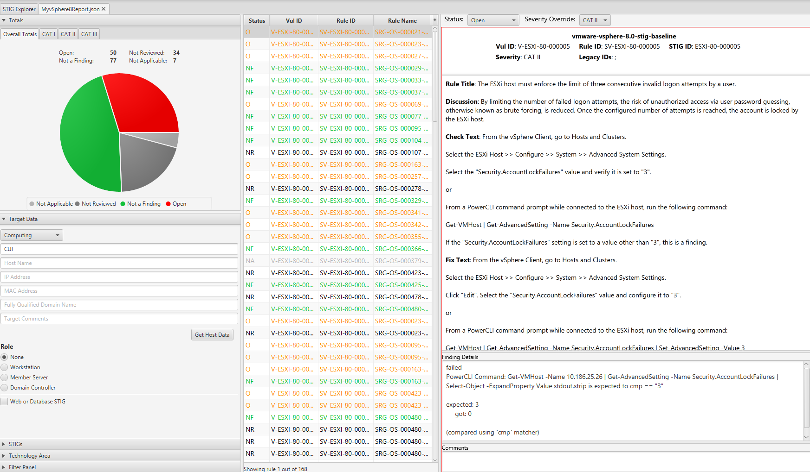

# Audit vSphere 8 U1
Auditing vSphere 8 U1 for STIG Compliance

## Overview
Auditing vSphere for STIG compliance involves scanning ESXi, Virtual Machines, vCenter, and the vCenter appliance.

When auditing vSphere we will split up tasks between product and appliance based controls which are defined as follows:

* **Product Control:** Configurations that interact with the Product via the User Interface or API that are exposed to administrators. Whether these are Default or Non-Default, the risk of mis-configuration affecting availability of the product is low but could impact how the environment is operated if not assessed.
* **Appliance Control:** Appliance controls deal with the underlying components (databases, web servers, Photon OS, etc) that make up the product. Altering these add risk to product availability if precautionary steps and care in implementation are not taken. Identifying and relying on Default settings in this category makes this category less risky (Default Appliance Controls should be seen as a positive).

To audit vSphere using InSpec we utilize the VMware transport(train-vmware) which connects to vCenter via PowerCLI and performs queries. For the vCenter appliance the auditing is performed via SSH. It is recommended to disable SSH on vCenter after the auditing is complete.

### Prerequisites
Versions listed below were used for this documentation. Other versions of these tools may work as well but if issues are found it is recommended to try the versions listed here.  

* PowerShell 7.3.4/PowerCLI 13.3 or newer
* [VMware.Vsphere.SsoAdmin PowerCLI Module 1.4.0](https://www.powershellgallery.com/packages/VMware.vSphere.SsoAdmin) or newer
* InSpec/Cinc Auditor 6.8.11
* train-vmware 0.2.0
* SAF CLI 1.4.20
* STIG Viewer 2.17
* A vSphere 8.x U1 or newer environment.
* An account with sufficient privileges to view SSO configuration in vCenter.
* Example distributed switches, VMs, and a content library were created in the testbed to produce audit results for those objects.  

### Assumptions
* Commands are being run from a Linux machine. Windows will also work but paths and commands may need to be adjusted from the examples.
* The [DOD Compliance and Automation](https://github.com/vmware/dod-compliance-and-automation) repository has been downloaded and extracted to `/usr/share/stigs`.
* CINC Auditor is used in lieu of InSpec. If InSpec is used replace `cinc-auditor` with `inspec` when running commands.

### Install the custom VMware transport for InSpec
To extend the functionality of the VMware transport that ships with InSpec we have created a custom one that also incorporates the `VMware.Vsphere.SsoAdmin` module to extend automation coverage to the vCenter SSO STIG controls.  

To install the plugin that is included with the `vmware-vsphere-8.0-stig-baseline` profile, do the following:

```powershell
# These steps are not needed on the STIG Tools Appliance
# Install the custom train-vmware plugin. Update the path to the gem as needed. The command will be the same on Windows and Linux.
> cinc-auditor plugin install /usr/share/stigs/vsphere/8.0/v2r3-stig/vsphere/inspec/vmware-vsphere-8.0-stig-baseline/train-vmware-0.2.0.gem

# To verify the installation
> cinc-auditor plugin list

┌────────────────────────────────────────┬─────────┬──────────────┬─────────┬────────────────────────────────────────────────────────────────────────┐
│              Plugin Name               │ Version │     Via      │ ApiVer  │                              Description                               │
├────────────────────────────────────────┼─────────┼──────────────┼─────────┼────────────────────────────────────────────────────────────────────────┤
│ inspec-compliance                      │ 6.6.0   │ core         │ 2       │ Plugin to perform operations with Chef Automate                        │
│ inspec-habitat                         │ 6.6.0   │ core         │ 2       │ Plugin to create/upload habitat package                                │
│ inspec-init                            │ 6.6.0   │ core         │ 2       │ Plugin for scaffolding profile, plugin or a resource                   │
│ inspec-license                         │ 6.6.0   │ core         │ 2       │ Plugin to list user licenses.                                          │
│ inspec-parallel                        │ 6.6.0   │ core         │ 2       │ Plugin to handle parallel InSpec scan operations over multiple targets │
│ inspec-plugin-manager-cli              │ 6.6.0   │ core         │ 2       │ CLI plugin for InSpec                                                  │
│ inspec-reporter-html2                  │ 6.6.0   │ core         │ 2       │ Improved HTML reporter plugin                                          │
│ inspec-reporter-json-min               │ 6.6.0   │ core         │ 2       │ Json-min json reporter plugin                                          │
│ inspec-reporter-junit                  │ 6.6.0   │ core         │ 2       │ JUnit XML reporter plugin                                              │
│ inspec-sign                            │ 6.6.0   │ core         │ 2       │                                                                        │
│ inspec-streaming-reporter-progress-bar │ 6.6.0   │ core         │ 2       │ Displays a real-time progress bar and control title as output          │
│ inspec-supermarket                     │ 6.6.0   │ core         │ 0       │                                                                        │
│ train-aws                              │ 0.2.36  │ gem (system) │ train-1 │ AWS API Transport for Train                                            │
│ train-habitat                          │ 0.2.22  │ gem (system) │ train-1 │ Habitat API Transport for Train                                        │
│ train-kubernetes                       │ 0.1.12  │ gem (system) │ train-1 │ Train Kubernetes                                                       │
│ train-vmware                           │ 0.2.0   │ gem (user)   │ train-1 │ Train Plugin for VMware PowerCLI                                       │
│ train-winrm                            │ 0.2.13  │ gem (system) │ train-1 │ Windows WinRM API Transport for Train                                  │
└────────────────────────────────────────┴─────────┴──────────────┴─────────┴────────────────────────────────────────────────────────────────────────┘
 17 plugin(s) total
 ```

## Auditing vSphere (Product Controls)

The example commands below are specific to the product version and the supported STIG content for the version being run. Select the example command tabs for the version in the environment.

### Setup environment variables for vCenter connection
Connectivity to vCenter is established via environment variables. Take care to clear the history and close the PowerShell session to avoid any credentials left in memory/history.

```bash
#Enter PowerShell
pwsh

# Note: VISERVER is referencing vCenter and not an ESXi host.
$env:VISERVER='10.186.30.81'
$env:VISERVER_USERNAME='Administrator@vsphere.local'
$env:VISERVER_PASSWORD='password'
```

*Note: If the password includes a single tick (') it must be substituted with four ticks ('''') in order for it to be properly escaped all the way through the process.*

### Auditing ESXi
#### Update profile inputs

Included in the `vmware-vsphere-8.0-stig-baseline` is an example `inputs-example.yml` file with variables relevant to ESXi.  This is used to provide InSpec with values specific to the environment being audited.

Open the inputs file for editing.

```bash
# Navigate to the InSpec profile folder
cd /usr/share/stigs/vsphere/8.0/v1r1-srg/vsphere/inspec/vmware-vsphere-8.0-stig-baseline

# Edit the inputs file
vi inputs-example.yml
```

Update the inputs as shown below with values relevant to the environment.

```yml
# Choose whether to scan a single host, all hosts in a cluster, or all hosts in vCenter.
vmhostName: '10.186.25.26'
cluster: ''
allesxi: false
# Set to true if hosts are joined to active directory for authentication
adJoined: false
# If ESXi is joined to AD, enter the AD group that has administrative access to ESXi.
adAdminGroup: 'MyAdAdminGroup'
# Enter the environment specific syslog server ESXi should be forwarding logs to
syslogServer: 'tcp://log.test.local:514'
# Enter the environment specific time servers.
esxiNtpServers:
  - 'time-a-g.nist.gov'
  - 'time-b-g.nist.gov'
# Enter the environment specific vMotion VLAN Id.
vMotionVlanId: '100'
# Enter the environment specific Management VLAN Id.
mgtVlanId: '101'
# Enter an array of users that should be in the lockdown mode exceptions list.
exceptionUsers:
  - root
  - dcui
# If snmp is used in the environment change to true.
snmpEnabled: 'false'
# Enter the latest build number for ESXi.
esxiBuildNumber: '21813344'
```

#### Run the audit
In this example a single ESXi host attached to the target vCenter will be scanned, specifying an inputs file, enabling enhanced outcomes in InSpec, and outputting a report to the CLI and to a JSON file.  

```bash
# Navigate to the InSpec profile folder
cd /usr/share/stigs/vsphere/8.0/v1r1-srg/vsphere/inspec/vmware-vsphere-8.0-stig-baseline

# Run the audit
> cinc-auditor exec ./esxi/ -t vmware:// --show-progress --enhanced-outcomes --input-file ./inputs-example.yml --reporter cli json:/tmp/reports/MyESXi8Report.json

# Shown below is the last part of the output at the CLI.
  [N/A]  ESXI-80-000241: The ESXi host must not use the default Active Directory ESX Admin group.
     [SKIP]  The ESXi host 10.186.25.26 is not joined to AD, so this control is not applicable.
  [PASS]  ESXI-80-000243: The ESXi host must configure a persistent log location for all locally stored logs.
     [PASS]  PowerCLI Command: $vmhost = Get-VMHost -Name 10.186.25.26; $esxcli = Get-EsxCli -VMHost $vmhost -V2; $esxcli.system.syslog.config.get.Invoke() | Select-Object -ExpandProperty LocalLogOutputIsPersistent stdout.strip is expected to cmp == "true"
  [FAIL]  ESXI-80-000244: The ESXi host must enforce the exclusive running of executables from approved VIBs.
     [FAIL]  PowerCLI Command: Get-VMHost -Name 10.186.25.26 | Get-AdvancedSetting -Name VMkernel.Boot.execInstalledOnly | Select-Object -ExpandProperty Value stdout.strip is expected to cmp == "true"

     expected: true
          got: False

     (compared using `cmp` matcher)

  [PASS]  ESXI-80-000245: The ESXi host must use sufficient entropy for cryptographic operations.
     [PASS]  PowerCLI Command: $vmhost = Get-VMHost -Name 10.186.25.26; $esxcli = Get-EsxCli -VMHost $vmhost -V2; $esxcli.system.settings.kernel.list.invoke()| Where {$_.Name -eq "disableHwrng"} | Select-Object -ExpandProperty Configured stdout.strip is expected to cmp == "FALSE"
     [PASS]  PowerCLI Command: $vmhost = Get-VMHost -Name 10.186.25.26; $esxcli = Get-EsxCli -VMHost $vmhost -V2; $esxcli.system.settings.kernel.list.invoke()| Where {$_.Name -eq "entropySources"} | Select-Object -ExpandProperty Configured stdout.strip is expected to cmp == "0"
  [PASS]  ESXI-80-000246: The ESXi host must not enable log filtering.
     [PASS]  PowerCLI Command: $vmhost = Get-VMHost -Name 10.186.25.26; $esxcli = Get-EsxCli -VMHost $vmhost -V2; $esxcli.system.syslog.config.logfilter.get.invoke() | Select-Object -ExpandProperty LogFilteringEnabled stdout.strip is expected to cmp == "false"

Profile Summary: 29 successful controls, 26 control failures, 18 controls not reviewed, 4 controls not applicable, 0 controls have error
Test Summary: 41 successful, 51 failures, 23 skipped
```

### Auditing Virtual Machines
#### Update profile inputs
Included in the `vmware-vsphere-8.0-stig-baseline` is an example `inputs-example.yml` file with variables relevant to VMs.  This is used to provide InSpec with values specific to the environment being audited.

Open the inputs file for editing.

```bash
# Navigate to the InSpec profile folder
cd /usr/share/stigs/vsphere/8.0/v1r1-srg/vsphere/inspec/vmware-vsphere-8.0-stig-baseline

# Edit the inputs file
vi inputs-example.yml
```

Update the inputs as shown below with values relevant to the environment.

```yml
# Choose whether to scan a single VM or all VMs in vCenter.
vmName: ""
allvms: true
```

#### Run the audit
In this example all VMs in the target vCenter will be scanned, specifying an inputs file, enabling enhanced outcomes in InSpec, and outputting a report to the CLI and to a JSON file.  

```bash
# Navigate to the InSpec profile folder
cd /usr/share/stigs/vsphere/8.0/v1r1-srg/vsphere/inspec/vmware-vsphere-8.0-stig-baseline

# Run the audit
cinc-auditor exec ./vm/ -t vmware:// --show-progress --enhanced-outcomes --input-file ./inputs-example.yml --reporter cli json:/tmp/reports/MyVMs8Report.json

# Shown below is the last part of the output at the CLI.
  [PASS]  VMCH-80-000207: Virtual machines (VMs) must enable logging.
     [PASS]  VM: stig vm2 is expected to cmp == "true"
     [PASS]  VM: stigvm1 is expected to cmp == "true"
     [PASS]  VM: vCLS-1446f2cc-b6b7-4778-84b7-f73f758dd46c is expected to cmp == "true"
     [PASS]  VM: vCLS-28a51340-7070-4437-b4b1-a87b7480ac7d is expected to cmp == "true"
     [PASS]  VM: vCLS-b680b5a0-5434-48a0-8420-82c95e5ab481 is expected to cmp == "true"
  [PASS]  VMCH-80-000208: Virtual machines (VMs) must not use independent, non-persistent disks.
     [PASS]  Checking the VM: stig vm2 for Non-Persistent Hard Disks is expected not to cmp == "IndependentNonPersistent"
     [PASS]  Checking the VM: stigvm1 for Non-Persistent Hard Disks is expected not to cmp == "IndependentNonPersistent"
     [PASS]  Checking the VM: vCLS-1446f2cc-b6b7-4778-84b7-f73f758dd46c for Non-Persistent Hard Disks is expected not to cmp == "IndependentNonPersistent"
     [PASS]  Checking the VM: vCLS-28a51340-7070-4437-b4b1-a87b7480ac7d for Non-Persistent Hard Disks is expected not to cmp == "IndependentNonPersistent"
     [PASS]  Checking the VM: vCLS-b680b5a0-5434-48a0-8420-82c95e5ab481 for Non-Persistent Hard Disks is expected not to cmp == "IndependentNonPersistent"
  [PASS]  VMCH-80-000209: Virtual machines (VMs) must remove unneeded floppy devices.
     [PASS]  Checking the VM: stig vm2 for Floppy drives is expected to be empty
     [PASS]  Checking the VM: stigvm1 for Floppy drives is expected to be empty
     [PASS]  Checking the VM: vCLS-1446f2cc-b6b7-4778-84b7-f73f758dd46c for Floppy drives is expected to be empty
     [PASS]  Checking the VM: vCLS-28a51340-7070-4437-b4b1-a87b7480ac7d for Floppy drives is expected to be empty
     [PASS]  Checking the VM: vCLS-b680b5a0-5434-48a0-8420-82c95e5ab481 for Floppy drives is expected to be empty
  [PASS]  VMCH-80-000210: Virtual machines (VMs) must remove unneeded CD/DVD devices.
     [PASS]  Checking the VM: stig vm2 for CD/DVD drives is expected to cmp == "false"
     [PASS]  Checking the VM: stigvm1 for CD/DVD drives is expected to cmp == "false"
     [PASS]  Checking the VM: vCLS-1446f2cc-b6b7-4778-84b7-f73f758dd46c for CD/DVD drives is expected to be empty
     [PASS]  Checking the VM: vCLS-28a51340-7070-4437-b4b1-a87b7480ac7d for CD/DVD drives is expected to be empty
     [PASS]  Checking the VM: vCLS-b680b5a0-5434-48a0-8420-82c95e5ab481 for CD/DVD drives is expected to be empty
  [PASS]  VMCH-80-000211: Virtual machines (VMs) must remove unneeded parallel devices.
     [PASS]  Checking the VM: stig vm2 for parallel devices is expected not to match "Parallel"
     [PASS]  Checking the VM: stigvm1 for parallel devices is expected not to match "Parallel"
     [PASS]  Checking the VM: vCLS-1446f2cc-b6b7-4778-84b7-f73f758dd46c for parallel devices is expected not to match "Parallel"
     [PASS]  Checking the VM: vCLS-28a51340-7070-4437-b4b1-a87b7480ac7d for parallel devices is expected not to match "Parallel"
     [PASS]  Checking the VM: vCLS-b680b5a0-5434-48a0-8420-82c95e5ab481 for parallel devices is expected not to match "Parallel"
  [PASS]  VMCH-80-000212: Virtual machines (VMs) must remove unneeded serial devices.
     [PASS]  Checking the VM: stig vm2 for serial devices is expected not to match "Serial"
     [PASS]  Checking the VM: stigvm1 for serial devices is expected not to match "Serial"
     [PASS]  Checking the VM: vCLS-1446f2cc-b6b7-4778-84b7-f73f758dd46c for serial devices is expected not to match "Serial"
     [PASS]  Checking the VM: vCLS-28a51340-7070-4437-b4b1-a87b7480ac7d for serial devices is expected not to match "Serial"
     [PASS]  Checking the VM: vCLS-b680b5a0-5434-48a0-8420-82c95e5ab481 for serial devices is expected not to match "Serial"
  [FAIL]  VMCH-80-000213: Virtual machines (VMs) must remove unneeded USB devices. (2 failed)
     [FAIL]  Checking the VM: stig vm2 for USB devices is expected not to match "USB"
     expected "IDE 0\r\nIDE 1\r\nPS2 controller 0\r\nPCI controller 0\r\nSIO controller 0\r\nKeyboard \r\nPointing ...er \r\nSCSI controller 0\r\nSATA controller 0\r\nCD/DVD drive 1\r\nHard disk 1\r\nNetwork adapter 1" not to match "USB"

     [FAIL]  Checking the VM: stigvm1 for USB devices is expected not to match "USB"
     expected "IDE 0\r\nIDE 1\r\nPS2 controller 0\r\nPCI controller 0\r\nSIO controller 0\r\nKeyboard \r\nPointing ...er \r\nSCSI controller 0\r\nSATA controller 0\r\nCD/DVD drive 1\r\nHard disk 1\r\nNetwork adapter 1" not to match "USB"

     [PASS]  Checking the VM: vCLS-1446f2cc-b6b7-4778-84b7-f73f758dd46c for USB devices is expected not to match "USB"
     [PASS]  Checking the VM: vCLS-28a51340-7070-4437-b4b1-a87b7480ac7d for USB devices is expected not to match "USB"
     [PASS]  Checking the VM: vCLS-b680b5a0-5434-48a0-8420-82c95e5ab481 for USB devices is expected not to match "USB"
  [PASS]  VMCH-80-000214: Virtual machines (VMs) must disable DirectPath I/O devices when not required.
     [PASS]  Checking the VM: stig vm2 for PCI passthrough devices is expected to be empty
     [PASS]  Checking the VM: stigvm1 for PCI passthrough devices is expected to be empty
     [PASS]  Checking the VM: vCLS-1446f2cc-b6b7-4778-84b7-f73f758dd46c for PCI passthrough devices is expected to be empty
     [PASS]  Checking the VM: vCLS-28a51340-7070-4437-b4b1-a87b7480ac7d for PCI passthrough devices is expected to be empty
     [PASS]  Checking the VM: vCLS-b680b5a0-5434-48a0-8420-82c95e5ab481 for PCI passthrough devices is expected to be empty

Profile Summary: 23 successful controls, 2 control failures, 0 controls not reviewed, 0 controls not applicable, 0 controls have error
Test Summary: 121 successful, 4 failures, 0 skipped
```

### Auditing vCenter
#### Update profile inputs
Included in the `vmware-vsphere-8.0-stig-baseline` is an example `inputs-example.yml` file with variables relevant to vCenter.  This is used to provide InSpec with values specific to the environment being audited.

Open the inputs file for editing.

```bash
# Navigate to the InSpec profile folder
cd /usr/share/stigs/vsphere/8.0/v1r1-srg/vsphere/inspec/vmware-vsphere-8.0-stig-baseline

# Edit the inputs file
vi inputs-example.yml
```

Update the inputs as shown below with values relevant to the environment.

```yml
# Enter the environment specific syslog server vCenter should be forwarding logs to.
syslogServers:
  - 'loginsight.vmware.com'
  - 'syslog.server2.com'
# Enter the environment specific time servers.
ntpServers:
  - 'time-a-g.nist.gov'
  - 'time-b-g.nist.gov'
# If an IPfix collector is used enter the IP.
ipfixCollectorAddress: ''
# List any users/groups that should be in the default roles that have crypto permissions. The default users/groups are provided below.
vcCryptoAdmins:
  - 'VSPHERE.LOCAL\Administrator'
  - 'VSPHERE.LOCAL\Administrators'
  - 'VSPHERE.LOCAL\vCLSAdmin'
# List any roles that are approved to have crypto permissions. The default roles are provided below.
vcCryptoRoles:
  - 'Admin'
  - 'NoTrustedAdmin'
  - 'vCLSAdmin'
  - 'vSphereKubernetesManager'
# Enter any approved users in the bash shell administrators users group
bashShellAdminUsers:
  - 'Administrator'
# Enter any approved group in the bash shell administrators group
bashShellAdminGroups: []
# Enter any approved users in the trusted admin users group
trustedAdminUsers: []
# Enter any approved users in the trusted admin group
trustedAdminGroups: []
# Set to false if file based backups are used via the VAMI
backup3rdParty: false
```

#### Run the audit
In this example vCenter controls in the target vCenter will be scanned, specifying an inputs file, enabling enhanced outcomes in InSpec, and outputting a report to the CLI and to a JSON file.  

```bash
# Navigate to the InSpec profile folder
cd /usr/share/stigs/vsphere/8.0/v1r1-srg/vsphere/inspec/vmware-vsphere-8.0-stig-baseline

# Run the audit
cinc-auditor exec ./vcenter/ -t vmware:// --show-progress --enhanced-outcomes --input-file ./inputs-example.yml --reporter cli json:/tmp/reports/MyvCenter8Report.json

# Shown below is the last part of the output at the CLI.
  [PASS]  VCSA-80-000302: The vCenter Server must reset port configuration when virtual machines are disconnected.
     [PASS]  PowerCLI Command: (Get-VDPortgroup -Name "VDSwitch STIG 1-DVUplinks-40").ExtensionData.Config.Policy.PortConfigResetAtDisconnect stdout.strip is expected to cmp == "True"
     [PASS]  PowerCLI Command: (Get-VDPortgroup -Name "VD PG 1").ExtensionData.Config.Policy.PortConfigResetAtDisconnect stdout.strip is expected to cmp == "True"
     [PASS]  PowerCLI Command: (Get-VDPortgroup -Name "VD PG 2").ExtensionData.Config.Policy.PortConfigResetAtDisconnect stdout.strip is expected to cmp == "True"
     [PASS]  PowerCLI Command: (Get-VDPortgroup -Name "VDSwitch STIG 2-DVUplinks-44").ExtensionData.Config.Policy.PortConfigResetAtDisconnect stdout.strip is expected to cmp == "True"
     [PASS]  PowerCLI Command: (Get-VDPortgroup -Name "VD PG 3").ExtensionData.Config.Policy.PortConfigResetAtDisconnect stdout.strip is expected to cmp == "True"
     [PASS]  PowerCLI Command: (Get-VDPortgroup -Name "VD PG 4").ExtensionData.Config.Policy.PortConfigResetAtDisconnect stdout.strip is expected to cmp == "True"
  [FAIL]  VCSA-80-000303: The vCenter Server must disable Secure Shell (SSH) access.
     [FAIL]  True is expected not to cmp == "true"

     expected: true
          got: True

     (compared using `cmp` matcher)

  [FAIL]  VCSA-80-000304: The vCenter Server must enable data in transit encryption for vSAN.
     [FAIL]  PowerCLI Command: $vsanclusterconf = Get-VsanView -Id VsanVcClusterConfigSystem-vsan-cluster-config-system; $vsanclusterconf.VsanClusterGetConfig((Get-Cluster -Name cluster0).ExtensionData.MoRef).DataInTransitEncryptionConfig.Enabled stdout.strip is expected to cmp == "true"

     expected: true
          got:

     (compared using `cmp` matcher)

Profile Summary: 25 successful controls, 22 control failures, 16 controls not reviewed, 3 controls not applicable, 0 controls have error
Test Summary: 136 successful, 26 failures, 20 skipped
```

### Run a combined scan for all vSphere product controls
Instead of running each STIG for product controls separately, all of the vCenter, ESXi, and VM controls can be run for a combined report.

```bash
# Navigate to the InSpec profile folder
cd /usr/share/stigs/vsphere/8.0/v1r1-srg/vsphere/inspec/vmware-vsphere-8.0-stig-baseline

# Run the audit
cinc-auditor exec . -t vmware:// --show-progress --enhanced-outcomes --input-file ./inputs-example.yml --reporter cli json:/tmp/reports/MyvSphere8Report.json
```

### InSpec runner scripts
For accreditation purposes there may be a requirement to produce a CKL file for each ESXi host and/or VM. We have also created a PowerCLI script that acts as a runner for InSpec to loop through a list of hosts or VMs, then produce a json report for each, and if the SAF CLI is installed also create a CKL file.  

With this script an [attestation](../../../automation-tools/safcli.md) file can also be provided that will be applied to the results and incorporated into the CKL file.

#### Using the ESXi runner script
To use the runner script, do the following:

```powershell
# Enter PowerShell
pwsh

# If not already previously done setup the credential for the vCenter connection.
# Note: VISERVER is referencing vCenter and not an ESXi host.
$env:VISERVER='10.186.30.81'
$env:VISERVER_USERNAME='Administrator@vsphere.local'
$env:VISERVER_PASSWORD='password'

# Navigate to the powercli folder
cd /usr/share/stigs/vsphere/8.0/v1r1-srg/vsphere/powercli

# Run the script
./VMware_vSphere_8.0_STIG_ESXi_InSpec_Runner.ps1 -vcenter 10.186.30.81 -reportPath /tmp/reports -inspecPath /usr/share/stigs/vsphere/8.0/v1r1-srg/vsphere/inspec/vmware-vsphere-8.0-stig-baseline -inputsfile ./vmware-vsphere-8.0-stig-esxi-inspec-runner-inputs-example.yml

# You will be prompted for credentials to vCenter. This is to connect via PowerCLI before running InSpec to collect all of the host names to use as an input to InSpec for each individual host audit.
10:08:10 AM ...Enter credentials to connect to vCenter

PowerShell credential request
Enter credentials for vCenter
User: administrator@vsphere.local
Password for user administrator@vsphere.local: ****************

10:08:23 AM ...Connecting to vCenter Server 10.186.30.81
10:08:26 AM ...Getting PowerCLI objects for all ESXi hosts in vCenter: 10.186.30.81
10:08:27 AM ...Validated path for report at C:\Inspec\Reports\Runner
10:08:27 AM ...Report path is C:\Inspec\Reports\Runner and report file is C:\Inspec\Reports\Runner\VMware_vSphere_8.0_STIG_ESXi_Inspec_Report_10.186.16.13-6-7-2023_10-8-4.json
10:08:27 AM ...Running InSpec exec against 10.186.16.13 with inspec exec $inspecPath -t vmware:// --input vmhostName=$name --input-file $inputsFile --show-progress --reporter=json:$reportFile
FFFF...F...*.FF*..FFFFF.**.*.FF*.FFF.F..F*F.**********............F..*F.FF.F*..FFFF**FFFFFFFFFFFFFFFFF.FFFFF**.F...
10:10:06 AM ...Detected saf cli...generating STIG Viewer Checklist for 10.186.16.13
10:10:11 AM ...Report path is C:\Inspec\Reports\Runner and report file is C:\Inspec\Reports\Runner\VMware_vSphere_8.0_STIG_ESXi_Inspec_Report_10.186.16.134-6-7-2023_10-8-4.json
10:10:11 AM ...Running InSpec exec against 10.186.16.134 with inspec exec $inspecPath -t vmware:// --input vmhostName=$name --input-file $inputsFile --show-progress --reporter=json:$reportFile
FFFF...F...*.FF*..FFFFF.**.*.FF*.FFF.F..F*F.**********............F..*F.FF.F*..FFFF**FFFFFFFFFFFFFFFFF.FFFFF**.F...
10:11:51 AM ...Detected saf cli...generating STIG Viewer Checklist for 10.186.16.134
10:11:56 AM ...Report path is C:\Inspec\Reports\Runner and report file is C:\Inspec\Reports\Runner\VMware_vSphere_8.0_STIG_ESXi_Inspec_Report_10.186.25.26-6-7-2023_10-8-4.json
10:11:56 AM ...Running InSpec exec against 10.186.25.26 with inspec exec $inspecPath -t vmware:// --input vmhostName=$name --input-file $inputsFile --show-progress --reporter=json:$reportFile
FFFF...F...*.FF*..FFFFF.**.*.FF*.FFF.F..F*F.**********............F..*F.FF.F*..FFFF**FFFFFFFFFFFFFFFFF.FFFFF**.F...
10:13:26 AM ...Detected saf cli...generating STIG Viewer Checklist for 10.186.25.26
10:13:30 AM ...Disconnecting from vCenter

# Resulting output
ls /tmp/reports

    Directory: /tmp/reports

Mode                 LastWriteTime         Length Name
----                 -------------         ------ ----
-a---            6/7/2023 10:10 AM         473286 VMware_vSphere_8.0_STIG_ESXi_Inspec_Report_10.186.16.13-6-7-2023_10-8-4.ckl
-a---            6/7/2023 10:10 AM         521076 VMware_vSphere_8.0_STIG_ESXi_Inspec_Report_10.186.16.13-6-7-2023_10-8-4.json
-a---            6/7/2023 10:11 AM         473364 VMware_vSphere_8.0_STIG_ESXi_Inspec_Report_10.186.16.134-6-7-2023_10-8-4.ckl
-a---            6/7/2023 10:11 AM         521228 VMware_vSphere_8.0_STIG_ESXi_Inspec_Report_10.186.16.134-6-7-2023_10-8-4.json
-a---            6/7/2023 10:13 AM         473286 VMware_vSphere_8.0_STIG_ESXi_Inspec_Report_10.186.25.26-6-7-2023_10-8-4.ckl
-a---            6/7/2023 10:13 AM         521082 VMware_vSphere_8.0_STIG_ESXi_Inspec_Report_10.186.25.26-6-7-2023_10-8-4.json

# If you want to specify a attestation file to incorporate into the CKL results you can add the attestation argument to the command as follows:
./VMware_vSphere_8.0_STIG_ESXi_InSpec_Runner.ps1 -vcenter 10.186.30.81 -reportPath /tmp/reports -inspecPath /usr/share/stigs/vsphere/8.0/v1r1-srg/vsphere/inspec/vmware-vsphere-8.0-stig-baseline -inputsfile ./vmware-vsphere-8.0-stig-esxi-inspec-runner-inputs-example.yml -attestationFile ./vmware-vsphere-8.0-stig-esxi-inspec-runner-attestation-example.yml

# Resulting output
ls /tmp/reports

    Directory: /tmp/reports

Mode                 LastWriteTime         Length Name
----                 -------------         ------ ----
-a---            6/7/2023 10:39 AM         473326 VMware_vSphere_8.0_STIG_ESXi_Inspec_Report_10.186.16.13-6-7-2023_10-37-15_with_Attestations.ckl
-a---            6/7/2023 10:39 AM         592992 VMware_vSphere_8.0_STIG_ESXi_Inspec_Report_10.186.16.13-6-7-2023_10-37-15_with_Attestations.json
-a---            6/7/2023 10:39 AM         521084 VMware_vSphere_8.0_STIG_ESXi_Inspec_Report_10.186.16.13-6-7-2023_10-37-15.json
-a---            6/7/2023 10:41 AM         473404 VMware_vSphere_8.0_STIG_ESXi_Inspec_Report_10.186.16.134-6-7-2023_10-37-15_with_Attestations.ckl
-a---            6/7/2023 10:41 AM         593137 VMware_vSphere_8.0_STIG_ESXi_Inspec_Report_10.186.16.134-6-7-2023_10-37-15_with_Attestations.json
-a---            6/7/2023 10:40 AM         521230 VMware_vSphere_8.0_STIG_ESXi_Inspec_Report_10.186.16.134-6-7-2023_10-37-15.json
-a---            6/7/2023 10:42 AM         473326 VMware_vSphere_8.0_STIG_ESXi_Inspec_Report_10.186.25.26-6-7-2023_10-37-15_with_Attestations.ckl
-a---            6/7/2023 10:42 AM         592988 VMware_vSphere_8.0_STIG_ESXi_Inspec_Report_10.186.25.26-6-7-2023_10-37-15_with_Attestations.json
-a---            6/7/2023 10:42 AM         521082 VMware_vSphere_8.0_STIG_ESXi_Inspec_Report_10.186.25.26-6-7-2023_10-37-15.json
```

## Auditing vCenter (Appliance Controls)
Auditing the vCenter appliance is done over SSH which must be enabled for the scan.

### Update the default shell for root
The default shell for root must be changed to `/bin/bash` before running. The appliance shell causes issues with some controls running.

```bash
# SSH to vCenter
Connected to service

    * List APIs: "help api list"
    * List Plugins: "help pi list"
    * Launch BASH: "shell"

Command> shell.set --enabled true
Command> shell
Shell access is granted to root
root@sc1-10-182-131-166 [ ~ ]# chsh -s /bin/bash root
```

### Run the audit
In this example a vCenter appliance will be scanned, specifying an inputs file, and outputting a report to the CLI and to a JSON file.  

Updating the inputs file is not required for this profile but the `inputs-vcsa-8.0.yml` should be specified because it contains inputs for the Photon profile.  

*Note: An inputs file is no longer required when running the v2r2 automation or newer for the VCSA scan.*  

```bash
# Navigate to the InSpec profile folder
cd /usr/share/stigs/vsphere/8.0/v1r1-srg/vcsa/inspec/vmware-vcsa-8.0-stig-baseline

# Run the audit
cinc-auditor exec . -t ssh://root@10.186.30.81 --password 'password' --show-progress --enhanced-outcomes --input-file ./inputs-vcsa-8.0.yml --reporter cli json:/tmp/reports/MyVCSA8Report.json

# Shown below is the last part of the output at the CLI.
  [PASS]  VCUI-80-000141: The vCenter UI service example applications must be removed.
     [PASS]  false is expected to cmp == "false"
  [PASS]  VCUI-80-000142: The vCenter UI service default ROOT web application must be removed.
     [PASS]  Command: `ls /usr/lib/vmware-vsphere-ui/server/webapps/ROOT` stdout.strip is expected to cmp == ""
  [PASS]  VCUI-80-000143: The vCenter UI service default documentation must be removed.
     [PASS]  false is expected to cmp == "false"
  [PASS]  VCUI-80-000151: The vCenter UI service must disable "ALLOW_BACKSLASH".
     [PASS]  is expected to be in nil and "false"
  [PASS]  VCUI-80-000152: The vCenter UI service must enable "ENFORCE_ENCODING_IN_GET_WRITER".
     [PASS]  is expected to be in nil and "true"
  [PASS]  VCUI-80-000154: The vCenter UI service manager webapp must be removed.
     [PASS]  false is expected to cmp == "false"
  [PASS]  VCUI-80-000155: The vCenter UI service host-manager webapp must be removed.
     [PASS]  false is expected to cmp == "false"

Profile Summary: 304 successful controls, 25 control failures, 0 controls skipped
Test Summary: 1240 successful, 80 failures, 0 skipped
```

## Convert the results to CKL
If a STIG Viewer CKL file is needed then the results from the scans can be converted to CKL with the [SAF CLI](../../../automation-tools/safcli.md).

```bash
# Converting the VCSA scan results from the prior section to CKL
saf convert hdf2ckl -i /tmp/reports/MyVCSA8Report.json -o /tmp/reports/MyVCSA8Report.ckl --hostname 10.186.30.81 --fqdn myvcenter.local --ip 10.186.30.81 --mac 00:00:00:00:00:00
```

Opening the CKL file in STIG Viewer will look like the screenshot below. Note the InSpec results are included in the `Finding Details` pane.  

